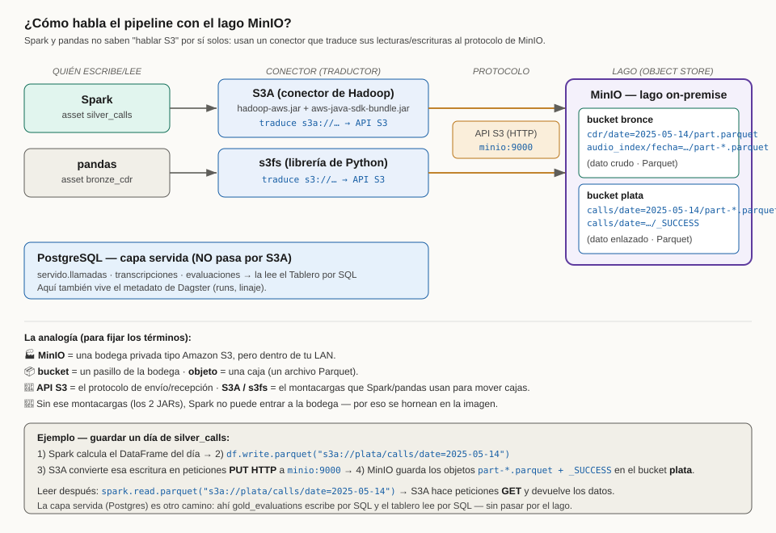
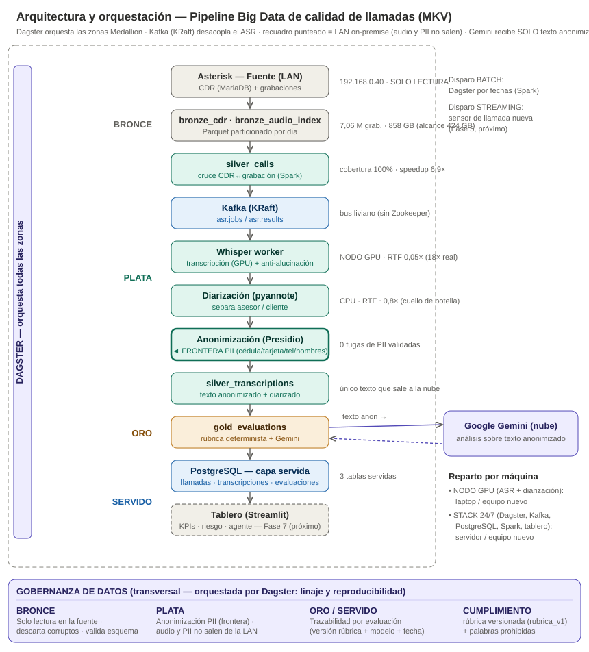
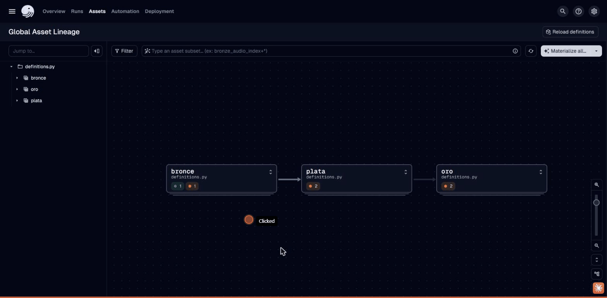
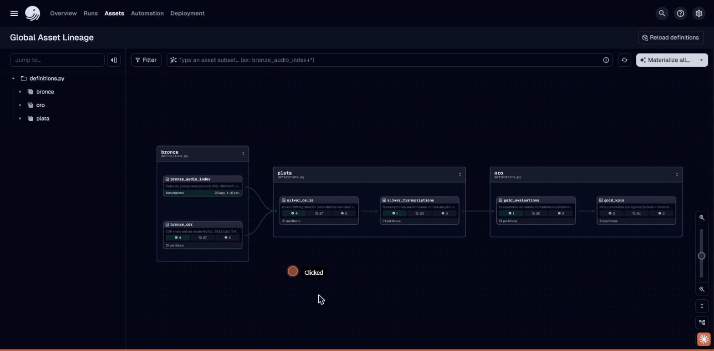
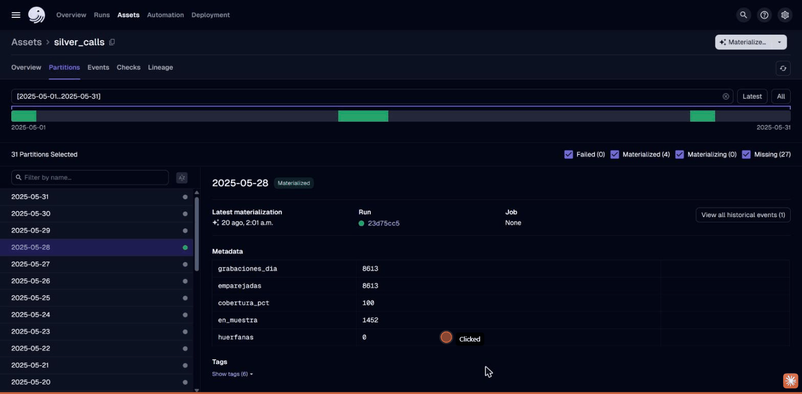
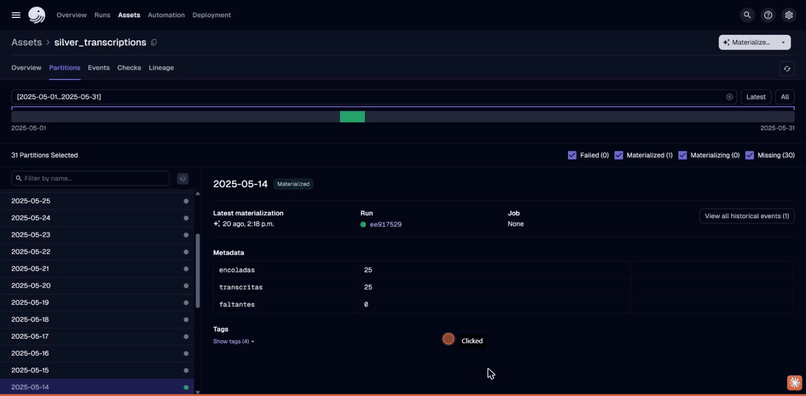
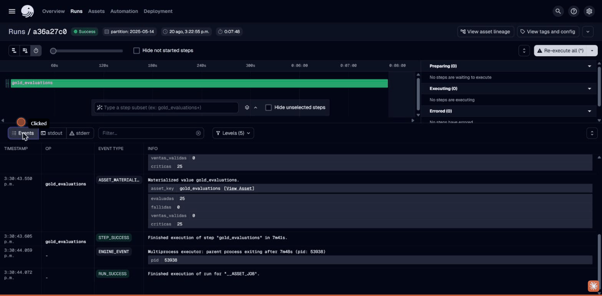
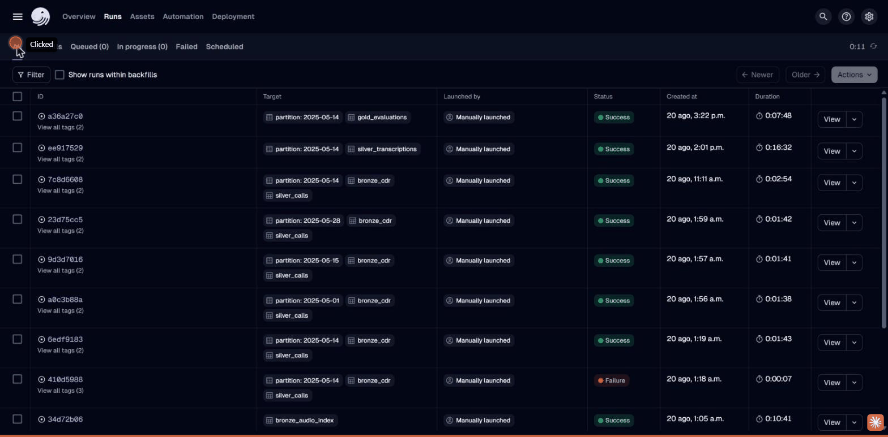
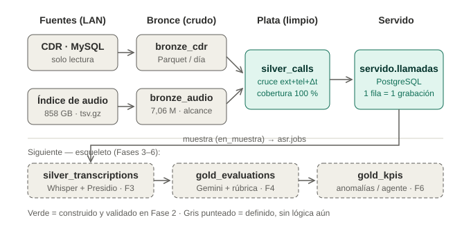

# Evidencia y guía de operación de la plataforma Dagster

**Proyecto:** Solución Big Data para auditoría automatizada de un call center de ventas
(CDR + grabaciones) — Maestría UISRAEL.
**Documento:** guía operativa y de evidencia del orquestador **Dagster** y el pipeline
Medallion (Bronce → Plata → Oro).
**Estado a la fecha de captura:** stack levantado y validado en vivo; Fases 1, 0, 2, 3 y 4
materializadas de extremo a extremo sobre datos reales de mayo 2025.

> Cómo usar este documento: las secciones 1–4 explican **qué es la plataforma y cómo moverse
> en ella**; las secciones 5–8 son el **recorrido por zona con los datos reales** que hoy
> están materializados; la sección 9 es el **análisis que debes hacer y revisar** en cada
> zona; la sección 10 es la **guía para recapturar cada pantalla** como evidencia para el
> tutor; y la 11 lista lo pendiente que también se ve en la interfaz.

---

## 1. Qué es esta plataforma y por qué Dagster

**Dagster** es el **orquestador** del proyecto: la herramienta que define, ejecuta, versiona
y **deja evidencia** de cada paso del procesamiento de datos. No es una base de datos ni un
motor de cómputo; es el "director de orquesta" que decide **qué se calcula, en qué orden, con
qué dependencias y con qué resultado**, y guarda el rastro de cada ejecución.

La pieza central de Dagster es el **activo de datos** (*Software-Defined Asset*): cada activo
es una **tabla o conjunto de datos que el pipeline produce** (por ejemplo, "el CDR crudo del
día" o "las llamadas emparejadas con su grabación"). Cada activo declara de qué otros activos
**depende**, de modo que Dagster construye automáticamente el **grafo de linaje** (el mapa de
qué alimenta a qué).

En este proyecto los activos están agrupados según la **arquitectura Medallion**, que organiza
el dato en tres zonas de calidad creciente:

| Zona | Grupo en Dagster | Qué contiene | Dónde se almacena | Gobernanza (PII) |
|------|------------------|--------------|-------------------|-------------------|
| **Bronce** | `bronce` | Dato **crudo**, tal como llega de la fuente (CDR y el índice de grabaciones) | **MinIO** — bucket `s3a://bronce` (Parquet) | Contiene datos personales; **nunca sale de la LAN** |
| **Plata** | `plata` | Dato **limpio y enlazado** (llamadas emparejadas con su audio) y **transcripciones anonimizadas** | **MinIO** — bucket `s3a://plata` (Parquet) + `servido.*` en PostgreSQL | La anonimización es la **frontera**: solo texto anonimizado avanza |
| **Oro** | `oro` | Dato **listo para análisis**: evaluaciones de calidad/cumplimiento y KPIs | `servido.*` en **PostgreSQL** (capa servida) | Sin PII; consumible por el tablero y por Gemini |

> **Almacenamiento (lago + almacén servido):** las zonas Bronce/Plata se guardan como **Parquet
> en MinIO** — un *object store* S3-compatible on-premise que actúa como **lago de datos** (encaja
> con la regla de gobernanza: self-hosted, en la LAN). La **capa servida** que consume el tablero
> (`servido.llamadas/transcripciones/evaluaciones`) vive en **PostgreSQL**. Dagster es el
> orquestador: no almacena los datos, solo su metadato de ejecución (runs/eventos), también en
> PostgreSQL. Spark lee/escribe el lago vía el conector **S3A** (`s3a://`).



*Figura A. Cómo Spark y pandas escriben/leen en MinIO: el conector **S3A** (dos JARs de Hadoop) y
**s3fs** traducen las rutas `s3a://`/`s3://` a llamadas de la **API S3 (HTTP)** contra
`minio:9000`; los objetos Parquet quedan en los buckets `bronce` y `plata`. La capa servida
(PostgreSQL) es un camino aparte por SQL.*



*Figura 1. Arquitectura integral. Dagster orquesta las tres zonas Medallion; la anonimización
(Presidio + spaCy) es la frontera a partir de la cual el texto puede salir a servicios externos.*

---

## 2. Cómo levantar la plataforma y acceder

Todo el stack (excepto el *worker* de transcripción) corre en Docker. Desde la raíz del repo:

```bash
docker compose -f infra/docker-compose.yml up -d
```

Esto levanta el stack. Puedes verificarlo con:

```bash
docker compose -f infra/docker-compose.yml ps
```

| Contenedor | Servicio | Puerto | Para qué |
|------------|----------|--------|----------|
| `uisrael_dagster_webserver` | Dagster UI | **3000** | La interfaz que documenta esta guía |
| `uisrael_dagster_daemon` | Dagster daemon | — | Ejecuta *runs*, *schedules* y *backfills* |
| `uisrael_postgres` | PostgreSQL | 5432 | Almacena el estado de Dagster **y** la capa servida (`servido.*`) |
| `uisrael_minio` | MinIO (object store) | **9000** / **9001** | **Lago de datos**: zonas Bronce/Plata en Parquet (API S3 en 9000, consola web en 9001) |
| `uisrael_kafka` | Kafka (KRaft) | 29092 | Bus de eventos entre el pipeline y el *worker* de transcripción |
| `uisrael_dashboard` | Streamlit | 8501 | Tablero analítico (aún placeholder, Fase 7) |

> Al arrancar, el contenedor efímero `uisrael_minio_init` crea los buckets `bronce` y `plata` y
> termina (mismo patrón que `kafka_init` con los topics).

**Accesos de la interfaz:**
- **Dagster UI → http://localhost:3000** (lo que recorremos aquí).
- **Consola de MinIO → http://localhost:9001** (usuario/clave `minioadmin`/`minioadmin` en dev):
  permite **navegar los buckets `bronce`/`plata` y ver los objetos Parquet** de cada zona/partición.
- **Tablero Streamlit → http://localhost:8501** (complemento; hoy muestra el estado de la
  infraestructura, los indicadores llegan en la Fase 7).

El **Whisper worker** (transcripción + anonimización + diarización) corre **nativo en el host**
(no en Docker) porque usa la GPU Arc por OpenVINO. Se lanza aparte cuando se materializa la zona
Plata de transcripciones:

```bash
PYTHONIOENCODING=utf-8 MAX_MSGS=0 ASR_DEVICE=GPU DIARIZE=1 whisper_worker/.venv/Scripts/python whisper_worker/worker.py
```

---

## 3. Mapa de la interfaz (barra superior)

Al abrir **http://localhost:3000** verás una barra de navegación con cinco secciones:

| Sección | Qué muestra | Cuándo la usas |
|---------|-------------|----------------|
| **Overview** | Resumen del despliegue (activos, jobs, estado general) | Vista de entrada |
| **Runs** | **Historial de ejecuciones** (cada materialización, con duración y estado) | Para auditar qué se ejecutó y cuándo |
| **Assets** | **Los activos y su linaje** — el corazón de la evidencia | Para ver el pipeline y los datos por zona |
| **Automation** | Schedules y sensores (automatización) | Fase 5 (streaming); hoy sin automatizaciones |
| **Deployment** | Estado del *code location*, errores de carga | Para confirmar que el código cargó sin errores |

En la esquina superior derecha, **"No errors"** / *Reload definitions* confirma que el código
del pipeline (`src/definitions.py`) cargó correctamente.

---

## 4. El grafo de activos (Global Asset Lineage) — la foto del pipeline

**Cómo llegar:** *Assets* → *View global asset lineage* (o
http://localhost:3000/asset-groups). Escribe `*` en el buscador de selección para incluir todos
los activos y **expande cada grupo** con el ícono de expandir del encabezado de la tarjeta.

Verás el pipeline completo como un grafo que fluye de izquierda a derecha, agrupado por zona:

```
  ZONA BRONCE                    ZONA PLATA                         ZONA ORO
┌───────────────────┐      ┌──────────────────────┐        ┌─────────────────────┐
│ bronze_audio_index├──┐   │ silver_calls         ├──┐     │ gold_evaluations    ├──┐
│                   │  ├──▶│                      │  ├────▶│                     │  │
│ bronze_cdr        ├──┘   │ silver_transcriptions│  │     │ gold_kpis (Fase 6)  │◀─┘
└───────────────────┘      └──────────────────────┘        └─────────────────────┘
```



*Captura 1. Vista de grupos colapsados: las tres zonas **bronce → plata → oro** conectadas por
sus dependencias. Los puntos de color resumen el estado de los activos de cada zona (verde =
materializado, ámbar = pendiente).*



*Captura 2. Los seis activos expandidos con sus contadores de particiones: Bronce
(`bronze_audio_index` materializado, `bronze_cdr` 4/27), Plata (`silver_calls` 4/27,
`silver_transcriptions` 1/30) y Oro (`gold_evaluations` 1/30, `gold_kpis` esqueleto).*

**Cómo se lee cada tarjeta de activo:**
- El **nombre** (p. ej. `silver_calls`) y su **descripción** (una línea de qué hace).
- Un **contador de particiones** con tres colores:
  - 🟢 **verde** = particiones **materializadas** (calculadas con éxito),
  - ⚪ **gris** = particiones **faltantes** (aún no calculadas),
  - 🔴 **rojo** = particiones **fallidas**.
- Las **flechas** entre tarjetas son las **dependencias** (linaje): `bronze_cdr` +
  `bronze_audio_index` alimentan `silver_calls`, que alimenta `silver_transcriptions`, y así
  hasta `gold_kpis`.

Estado observado hoy en el grafo (rango de desarrollo = mayo 2025, 31 días):

| Activo | Zona | Verde (materializadas) | Gris (faltantes) | Rojo |
|--------|------|------------------------|------------------|------|
| `bronze_audio_index` | Bronce | Materializado (sin particionar) | — | — |
| `bronze_cdr` | Bronce | 4 | 27 | 0 |
| `silver_calls` | Plata | 4 | 27 | 0 |
| `silver_transcriptions` | Plata | 1 | 30 | 0 |
| `gold_evaluations` | Oro | 1 | 30 | 0 |
| `gold_kpis` | Oro | 0 (esqueleto, Fase 6) | Todas | 0 |

> Lectura: las **particiones grises no son un error** — significan que ese día aún no se ha
> procesado. El diseño es **particionado por día** para poder reprocesar el histórico día a día
> (backfill) sin recomputar todo. En desarrollo se materializaron 4 días representativos
> (2025-05-01, 05-14, 05-15 y 05-28); la muestra de transcripción/evaluación se concentró en
> 2025-05-14.

---

## 5. Zona BRONCE — el dato crudo

La zona Bronce **ingiere el dato tal como está en la fuente**, sin transformarlo, y lo deja en
Parquet. Es la base auditable: si algo se cuestiona aguas abajo, aquí está el origen.

### 5.1 `bronze_cdr` — el registro de llamadas crudo
- **Qué es:** el CDR (Call Detail Record) del día, leído **en SOLO LECTURA** desde la base
  MariaDB de Asterisk, volcado a Parquet en `s3a://bronce/cdr`. Un CDR por llamada: extensión, teléfono destino,
  fecha, duración, `billsec`, `disposition` (ANSWERED / NO ANSWER / BUSY…), etc.
- **Particionado por día:** cada partición = un día de CDR.
- **Cómo verlo:** *Assets* → `bronze_cdr` → pestaña **Partitions**. En el detalle de una
  partición materializada verás el metadato `filas_cdr` (número de registros ingeridos ese día).
- **Qué analizar aquí:** volumen diario de llamadas, proporción de contestadas
  (`disposition = ANSWERED`), y detección de días vacíos o corruptos (recordar que el 2,25 %
  del CDR histórico trae fecha `0000-00-00`).

### 5.2 `bronze_audio_index` — el índice de grabaciones
- **Qué es:** el **índice del filesystem de grabaciones** del servidor (ruta, nombre, fecha,
  tamaño), acotado al **alcance del call center de ventas: extensiones 200–299, solo salientes
  (OUT)**. **No abre los audios** — solo cataloga su existencia y metadatos.
- **No particionado:** se construye de una vez sobre todo el índice y se reparte internamente
  por fecha.
- **Cómo verlo:** *Assets* → `bronze_audio_index`. Metadato `grabaciones_scope` = número de
  grabaciones dentro del alcance.
- **Qué analizar aquí:** cobertura temporal del audio (qué años/meses hay), y que el alcance
  200–299/OUT coincide con el universo esperado (~7,06 M grabaciones / 455 GB en el histórico).

---

## 6. Zona PLATA — el dato limpio, enlazado y anonimizado

La zona Plata es donde el dato **se vuelve utilizable**: se cruza el CDR con su grabación, se
selecciona la muestra analítica, se transcribe el audio y **se anonimiza** antes de dejar que el
texto avance. Aquí vive la **frontera de gobernanza**.

### 6.1 `silver_calls` — el cruce CDR ↔ grabación (núcleo de la Fase 2)
- **Qué es:** empareja cada CDR con su archivo de grabación usando la llave validada en la
  Fase 1 — `(extensión ∈ channel/dstchannel) + (dst = teléfono) + (|calldate − ts_grabación| ≤
  180 s)` — y marca la **muestra analítica** (`en_muestra = ANSWERED ∧ billsec ∈ [10, 3600]`).
  Escribe a Parquet en `s3a://plata/calls` **y** a la capa servida `servido.llamadas` (PostgreSQL).
- **El cruce opera SOLO sobre datos** (CDR + nombres del índice de audio); **no abre las
  grabaciones**. El audio se toca recién en la Fase 3.
- **Cómo verlo:** *Assets* → `silver_calls` → **Partitions** → clic en un día materializado.

**Metadatos reales capturados (partición 2025-05-28):**

| Metadato | Valor | Significado |
|----------|-------|-------------|
| `grabaciones_dia` | 8613 | Grabaciones del día en alcance |
| `emparejadas` | 8613 | CDR emparejados con su grabación |
| `cobertura_pct` | **100** | Cobertura del enlace CDR↔audio |
| `en_muestra` | 1452 | Llamadas que entran a la muestra analítica |
| `huerfanas` | 0 | Grabaciones sin CDR (no emparejadas) |



*Captura 3. Detalle de la partición `silver_calls` 2025-05-28 en la pestaña Partitions. La tabla
de Metadata muestra `cobertura_pct = 100`, `emparejadas = 8613` y `huerfanas = 0`, con enlace al
run que la produjo.*

> Este **100 % de cobertura con 0 huérfanas** es el resultado central de la Fase 2: demuestra
> que el enlace entre el registro de llamada y su grabación es completo y confiable, requisito
> para todo el análisis posterior.

### 6.2 `silver_transcriptions` — transcripciones anonimizadas (Fase 3)
- **Qué es:** toma la muestra del día (`en_muestra`) con audio disponible localmente, **encola
  trabajos en Kafka** (`asr.jobs`), el Whisper worker transcribe (OpenVINO/GPU Arc, con
  anti-alucinación), **anonimiza** (Presidio + spaCy: cédulas, tarjetas Luhn, teléfonos,
  nombres, y números dictados en voz → `<DATO_NUMERICO>`) y opcionalmente **diariza**
  (ASESOR/CLIENTE con pyannote); los resultados vuelven por `asr.results` y se guardan en
  `servido.transcripciones`. **Solo el texto anonimizado avanza.**
- **Cómo verlo:** *Assets* → `silver_transcriptions` → **Partitions** → 2025-05-14.

**Metadatos reales capturados (partición 2025-05-14):**

| Metadato | Valor | Significado |
|----------|-------|-------------|
| `encoladas` | 25 | Trabajos enviados al worker |
| `transcritas` | **25** | Transcripciones recibidas y guardadas |
| `faltantes` | 0 | Trabajos sin resultado |



*Captura 4. Partición `silver_transcriptions` 2025-05-14: `encoladas = 25`, `transcritas = 25`,
`faltantes = 0` — las 25 llamadas de la muestra del día se transcribieron y anonimizaron sin
pérdidas.*

**Analítica de la tabla `servido.transcripciones` (25 filas):** RTF promedio **0,084×** (unas
12× más rápido que tiempo real), duración media 152 s, ~3,2 *chunks* descartados por
anti-alucinación, **20/25 con `<NOMBRE>` detectado y 0 fugas de PII** (ninguna con 7+ dígitos
seguidos).

### 6.3 La frontera de gobernanza (por qué importa la zona Plata)
Antes de Plata, el texto no existe (solo audio con voz real). Dentro de Plata, la
**anonimización** convierte "el señor Juan Ramírez, cédula 17…" en "el señor `<NOMBRE>`, cédula
`<DATO_NUMERICO>`". **A partir de aquí** el texto puede analizarse con un LLM externo (Gemini)
sin exponer datos personales. Esta es la razón de que Bronce y Plata-crudo nunca salgan de la LAN.

---

## 7. Zona ORO — el dato listo para decidir

La zona Oro convierte las transcripciones anonimizadas en **evaluaciones y KPIs** que responden
la pregunta del negocio: ¿esta llamada cumple la política de calidad y de venta?

### 7.1 `gold_evaluations` — evaluación de calidad/cumplimiento (Fase 4)
- **Qué es:** análisis **híbrido** sobre el texto anonimizado — una **capa determinista**
  (`rubrica.py`: palabras/frases prohibidas del grupo B, con normalización de acentos y
  condicionales) más una **capa LLM** (Gemini evalúa criterios A01–A09, sentimiento, si hubo
  venta). Escribe a `servido.evaluaciones`.
- **Cómo verlo:** *Assets* → `gold_evaluations` → **Partitions** → 2025-05-14.

**Metadatos reales capturados (partición 2025-05-14):**

| Metadato | Valor | Significado |
|----------|-------|-------------|
| `evaluadas` | 25 | Llamadas evaluadas |
| `fallidas` | 0 | Errores de evaluación |
| `ventas_validas` | 0 | Ventas que cumplen toda la política |
| `criticas` | 25 | Llamadas con alguna observación crítica |


*Captura 5. Partición `gold_evaluations` 2025-05-14: `evaluadas = 25`, `fallidas = 0`,
`criticas = 25` — el análisis híbrido corrió sobre las 25 transcripciones anonimizadas.*

**Analítica de la tabla `servido.evaluaciones` (25 filas):** calidad media **15,4/100**;
distribución de riesgo de reclamo = **20 bajo / 2 medio / 3 alto**; infracciones del grupo B
detectadas automáticamente: **B16, B13, B07, B11**. El hallazgo discriminante del proyecto —
la palabra **"GARANTIZO" (B01, infracción crítica)** — fue detectado automáticamente en una de
las llamadas largas evaluadas aparte; es justo lo que la auditoría manual (que escucha pocas
llamadas de 45–50 min) rara vez alcanza a pillar.

> Nota de lectura: en esta muestra `ventas_validas = 0` porque los 25 audios de 2025-05-14 son
> prospección corta que **no cerró venta**; no muestran el caso "venta válida". Evaluar días con
> ventas cerradas es un pendiente de Fase 4 (ver §11).

### 7.2 `gold_kpis` — KPIs y anomalías por agente (esqueleto, Fase 6)
- **Qué será:** agregados por agente/periodo, KPI de intentos/reintentos por contacto y
  detección de **anomalías de rendimiento**. Hoy es un **activo esqueleto**: aparece en el grafo
  y declara su dependencia de `gold_evaluations`, pero su lógica se implementa en la Fase 6.
- **Cómo se ve:** en el grafo aparece sin particiones materializadas (esperado).

---

## 8. Cómo leer una **partición** y un **run** (evidencia de ejecución)

### 8.1 Vista de particiones (por activo)
En cualquier activo particionado, pestaña **Partitions**:
- Una **franja temporal** arriba con bloques verdes = días materializados.
- Los filtros **Failed / Materialized / Materializing / Missing** con su conteo.
- Al hacer **clic en un día**, el panel derecho muestra: la **última materialización** (fecha),
  el **Run** que la produjo (enlace), y la **tabla de Metadata** (los valores de las tablas de
  arriba). Esta es la evidencia por-día más granular.

### 8.2 Vista de un run (Runs → clic en un ID)
Cada ejecución tiene su página con:
- Un **diagrama de Gantt** de los *steps* con su **duración** (p. ej. `gold_evaluations` corrió
  **7 m 41 s**).
- Un **log de eventos** (pestaña *Events*) donde aparecen, en orden: `STEP_START`,
  `ASSET_MATERIALIZATION` (con **los metadatos incrustados**, p. ej. *evaluadas 25, criticas
  25*), `STEP_SUCCESS` y `RUN_SUCCESS`.
- Pestañas **stdout / stderr** con la salida cruda del proceso.



*Captura 7. Página del run de `gold_evaluations`: a la izquierda el Gantt del step (7 m 41 s);
abajo el log con el evento `ASSET_MATERIALIZATION` (evaluadas 25, criticas 25), seguido de
`STEP_SUCCESS` y `RUN_SUCCESS`.*

**Historial observado hoy (Runs → All):** se ve la traza completa de materializaciones del
20-ago con sus duraciones — `gold_evaluations` 7:48, `silver_transcriptions` 16:32, varios
`bronze_cdr` (~1:40 c/u), `bronze_audio_index` 10:41 — **incluidos dos runs fallidos**
(un `bronze_cdr` y un `bronze_audio_index` de 4–7 s). Los fallos forman parte de la evidencia:
muestran que la plataforma **registra y distingue** éxito de error, y que se corrigieron y
re-ejecutaron con éxito.



*Captura 6. Sección Runs → All: cada materialización con su objetivo (partición + activo), quién
la lanzó, estado, fecha y duración. Se aprecian los éxitos y el run fallido `410d5988`
(`bronze_cdr`, 7 s).*

---

## 9. Cómo analizar los datos procesados en cada zona (lo que debes revisar)

La interfaz de Dagster demuestra **que el pipeline corrió y con qué resultado**; el **análisis
del contenido** se hace sobre la capa servida en PostgreSQL (`servido.*`). Conéctate con:

```bash
docker exec -it uisrael_postgres psql -U dagster -d dagster
```

### 9.1 Análisis de la zona BRONCE (integridad de la fuente)
Qué revisar: volumen diario, contactabilidad, y anomalías de la fuente. En Dagster: metadato
`filas_cdr` por día. Sobre los datos:

```sql
SELECT fecha, count(*) AS grabaciones,
       sum((disposition='ANSWERED')::int) AS contestadas
FROM servido.llamadas GROUP BY fecha ORDER BY fecha;
```
Criterio: días con 0 filas o caídas bruscas de contactabilidad merecen inspección (posible CDR
corrupto o hueco de grabación).

### 9.2 Análisis de la zona PLATA — enlace (calidad del cruce)
Qué revisar: que la **cobertura sea ~100 %** y las **huérfanas ~0** en cada día. En Dagster:
metadatos `cobertura_pct` y `huerfanas` por partición. Sobre los datos:

```sql
SELECT fecha, count(*) grabaciones, sum(en_muestra::int) en_muestra
FROM servido.llamadas GROUP BY fecha ORDER BY fecha;
```
Distribución real observada:

| Fecha | Grabaciones | En muestra | Contestadas |
|-------|-------------|------------|-------------|
| 2025-05-01 | 2369 | 465 | 775 |
| 2025-05-14 | 6791 | 1389 | 2114 |
| 2025-05-15 | 6951 | 1386 | 2135 |
| 2025-05-28 | 8613 | 1452 | 2339 |

Criterio: `cobertura_pct < 98` o `huerfanas` alto = revisar la llave de enlace (ventana de
tiempo, formato de teléfono) antes de confiar en el análisis aguas abajo.

### 9.3 Análisis de la zona PLATA — transcripción (rendimiento y PII)
Qué revisar: **RTF** (que el proceso sea sostenible), *chunks* descartados (alucinación), y —
crítico — **que no haya fugas de PII**. Sobre los datos:

```sql
SELECT round(avg(proc_seg/nullif(dur_audio,0))::numeric,3) AS rtf_prom,
       round(avg(chunks_descartados)::numeric,1)          AS chunks_desc_prom,
       sum((transcript_anon ~ '[0-9]{7,}')::int)          AS posibles_fugas_pii
FROM servido.transcripciones;
```
Valores observados: RTF **0,084×**, ~3,2 *chunks* descartados/llamada, **0 posibles fugas**.
Criterio duro: `posibles_fugas_pii` **debe ser 0**; cualquier número ≥ 1 es un incidente de
gobernanza que bloquea el avance a Oro.

### 9.4 Análisis de la zona ORO (calidad y cumplimiento)
Qué revisar: distribución de calidad, riesgo de reclamo, infracciones prohibidas y —el objetivo—
**detección de infracciones críticas** que la auditoría manual no alcanza. Sobre los datos:

```sql
SELECT count(*) n, sum(infraccion_critica::int) criticas,
       round(avg(calidad_score)::numeric,1) calidad_prom,
       sum((riesgo_reclamo='alto')::int) riesgo_alto
FROM servido.evaluaciones;

-- Infracciones del grupo B (palabras/frases prohibidas)
SELECT grupo_b, count(*) FROM servido.evaluaciones
WHERE grupo_b <> '' GROUP BY grupo_b ORDER BY 2 DESC;
```
Valores observados: 25 evaluadas, 25 críticas, calidad media 15,4, 3 de riesgo alto; grupo B =
B16/B13/B07/B11. Criterio: cruzar `infraccion_critica` con `confianza_llm` para priorizar la
revisión humana, y calibrar los pesos de la rúbrica cuando se disponga de un *gold set* con
ventas cerradas.

---

## 10. Guía para recapturar la evidencia (para la presentación al tutor)

Cada pantalla siguiente ya fue verificada en vivo; captúralas en este orden para armar la
evidencia visual. En cada una, **resalta el dato en negrita**.

| # | Pantalla | Cómo llegar | Qué resaltar |
|---|----------|-------------|--------------|
| 1 | **Grafo global** | *Assets* → *View global asset lineage*, escribir `*`, expandir los 3 grupos | El flujo Bronce→Plata→Oro y los contadores de particiones |
| 2 | **Grupo Bronce** | *Assets* → grupo `bronce` → *Lineage* | `bronze_cdr` (4 verdes) + `bronze_audio_index` (materializado) |
| 3 | **silver_calls / partición** | `silver_calls` → *Partitions* → 2025-05-28 | **cobertura_pct = 100**, emparejadas 8613, huérfanas 0 |
| 4 | **silver_transcriptions / partición** | `silver_transcriptions` → *Partitions* → 2025-05-14 | **transcritas 25/25**, faltantes 0 |
| 5 | **gold_evaluations / partición** | `gold_evaluations` → *Partitions* → 2025-05-14 | **evaluadas 25, criticas 25** |
| 6 | **Historial de Runs** | *Runs* → *All* | Duraciones reales y estados (éxitos y los 2 fallos) |
| 7 | **Detalle de un Run** | *Runs* → clic en el run de `gold_evaluations` | Gantt del step + evento `ASSET_MATERIALIZATION` con metadatos |
| 8 | **Tablero (complemento)** | http://localhost:8501 | Estado de infraestructura (PostgreSQL OK); indicadores en Fase 7 |



*Figura 2. Detalle del pipeline batch de la Fase 2 (zonas y activos), útil para acompañar las
capturas 1–3.*

> Nota técnica: las **Capturas 1–7** de este documento son imágenes **reales del Dagster UI en
> funcionamiento** (http://localhost:3000), tomadas con Claude in Chrome sobre el navegador real y
> guardadas en `docs/evidencia_dagster/`. Las Figuras 1 y 2 son las figuras vectoriales del propio
> proyecto (`docs/figuras/`). La tabla de arriba te sirve para **volver a capturar** cualquier
> pantalla si cambian los datos.

---

## 11. Pendientes visibles en la interfaz (qué falta y por qué)

Lo que hoy se ve "incompleto" en el UI es **intencional** y corresponde al roadmap:

1. **Particiones grises (27–30 días de mayo sin materializar):** el desarrollo se validó sobre
   4 días representativos. Materializar el resto es un *backfill* directo cuando se decida
   procesar el mes completo.
2. **`gold_kpis` sin materializar (esqueleto):** los KPIs por agente, el KPI de intentos y la
   detección de anomalías se implementan en la **Fase 6**.
3. **`ventas_validas = 0` en la muestra:** falta evaluar días con **ventas cerradas** para ver
   el caso "venta válida" y construir el *gold set* con métricas P/R/F1 (**Fase 4**, pulido).
4. **Sección *Automation* vacía:** los *schedules/sensores* que convierten el pipeline en
   **streaming en tiempo real** son la **Fase 5**.
5. **Tablero Streamlit en placeholder:** los indicadores de calidad, contactabilidad, conversión
   y anomalías se conectan en la **Fase 7**.

---

## 12. Resumen de lo demostrado

Con el stack levantado y esta evidencia queda demostrado, de extremo a extremo y sobre datos
reales de mayo 2025, que:

- El pipeline **Medallion completo** (6 activos, 3 zonas) está **definido, orquestado y con
  linaje** en Dagster.
- La **Fase 2** logra **100 % de cobertura** en el enlace CDR↔grabación (0 huérfanas).
- La **Fase 3** transcribe y **anonimiza sin fugas de PII** (0 en la muestra), con RTF ~0,084×.
- La **Fase 4** evalúa calidad/cumplimiento de forma **híbrida** y **detecta automáticamente
  infracciones críticas** (incluida "GARANTIZO"/B01) que la auditoría manual no alcanza.
- Cada ejecución queda **auditada** (runs, duraciones, éxito/fallo, metadatos por partición).

*Documento generado a partir de la verificación en vivo del stack (Dagster UI en
http://localhost:3000 y capa servida en PostgreSQL). Complementa a `presentacion_1.md` y a
`docs/bitacora_tecnica.md`.*
