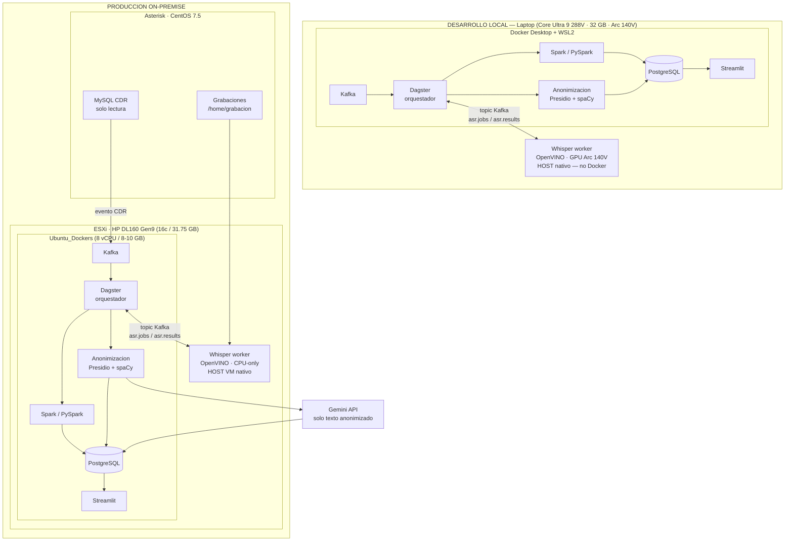
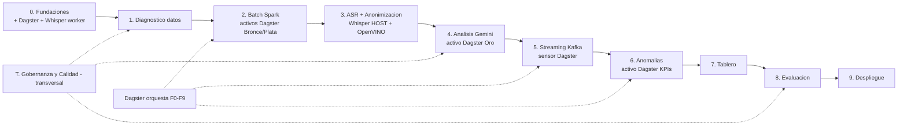
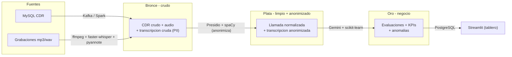

# Fases de Desarrollo — Implementación de la Solución

> **Proyecto:** Integración de analítica en tiempo real y LLMs para el análisis de
> grabaciones y CDR de call center (MKV / Diners Club).
> **Autor:** Carlos Enrique Miño Flores · Maestría en Big Data y Data Science (UISRAEL) · 2026.
>
> Este documento es mi **tracker maestro** de la implementación. Lo actualizo al
> avanzar/cerrar cada fase para saber, en cualquier reanudación, exactamente **dónde
> estoy y qué falta**. Cada fase la justifico con la metodología (DSR +
> CRISP-DM) y la ligo a los **objetivos específicos** del plan de titulación.

---

## Resumen

Tres diagramas para entender de un vistazo **la infraestructura**,
**las fases** y **las tecnologías/pipeline**.

### A) Infraestructura (on-premise + Gemini)

Todo lo sensible corre en la LAN; solo el **texto ya anonimizado** sale a la nube.
El desarrollo arranca en **local (laptop)** y luego se replica a la VM on-premise.



### B) Fases de implementación (batch primero, luego streaming)

Orden secuencial 0 → 9, con el **Componente transversal T** (Gobernanza y Calidad)
atravesando todas las fases.



| CRISP-DM | Fases |
|---|---|
| Comprensión del negocio / de los datos | 0, 1 |
| Preparación de datos | 2, 3 |
| Modelado | 4, 6 |
| Despliegue | 5, 7, 9 |
| Evaluación | 8 |
| Gobernanza y calidad (transversal) | T |

### C) Tecnologías y pipeline Medallion (Bronce → Plata → Oro)

Cada zona sube la calidad del dato; la **anonimización** es la frontera antes de Gemini.



| Etapa | Tecnología | Zona |
|---|---|---|
| Ingesta streaming | Apache Kafka | 🥉 |
| **Orquestación de workflows** | **Dagster** (Software-Defined Assets · linaje nativo · catálogo integrado) | todas |
| Procesamiento batch | Apache Spark / PySpark | 🥉🥈 |
| Normalización audio | ffmpeg | 🥉 |
| Transcripción + diarización | faster-whisper + WhisperX/pyannote · **OpenVINO** (aceleración Intel Arc/NPU en HOST) | 🥉 |
| Anonimización (frontera PII) | Presidio + spaCy | 🥉→🥈 |
| Análisis semántico | Gemini API (texto anonimizado) | 🥈→🥇 |
| Anomalías | scikit-learn (IsolationForest, autoencoders) | 🥇 |
| Capa servida | PostgreSQL | 🥇 |
| Tablero | Streamlit | — |
| Gobernanza y calidad | Great Expectations/pandera, pydantic, versionado | todas |

> **Nota — Dagster vs Airflow:** Se eligió Dagster sobre Apache Airflow (sugerido por el tutor) porque su
> paradigma de *Software-Defined Assets* se alinea directamente con la arquitectura Medallion: cada zona
> Bronce/Plata/Oro es un activo declarado con linaje, historial de materialización y catálogo integrado,
> cumpliendo de forma nativa los requisitos del Componente T (Gobernanza) sin instrumentación adicional.
> Airflow, orientado a tareas, requeriría herramientas externas para el mismo nivel de trazabilidad y
> consume ~3× más RAM (Redis + Celery + scheduler), crítico en la VM con 8–10 GB.
>
> **Nota — Whisper fuera de Docker:** Validado experimentalmente (2026-08-15): `/dev/dxg` (Intel DXCore)
> es accesible desde contenedores, pero el compute-runtime estándar de las imágenes Intel solo expone CPU.
> Whisper corre como **proceso nativo** en el host y se comunica con el pipeline via topics Kafka
> (`asr.jobs` / `asr.results`), usando OpenVINO para aprovechar el GPU Arc 140V (dev) o la CPU (prod).

> Detalle ampliado de cada pieza en [tecnologias.md](tecnologias.md), del flujo paso a
> paso en [pipeline.md](pipeline.md) y de la infraestructura/costos en
> [infraestructura.md](infraestructura.md).

---

## Marco metodológico (referencia rápida)

- **Design Science Research (DSR)** [Hevner, 2004]: ciclo *Relevancia → Diseño/Construcción → Evaluación → Rigor → Comunicación*. Cada fase declara a qué momento del DSR pertenece (construir un **artefacto** que resuelve un problema real y evaluarlo).
- **CRISP-DM** [Wirth & Hipp, 2000]: *Comprensión del negocio → Comprensión de los datos → Preparación → Modelado → Evaluación → Despliegue*. Guía el ciclo de datos y el pipeline.
- **Estrategia técnica:** **batch primero, luego streaming**; arquitectura híbrida (Lambda/Kappa) con **Kafka** (ingesta streaming) + **Spark** (batch) orquestados por **Dagster** (Software-Defined Assets / Medallion); **todo lo sensible on-premise** (ASR via Whisper+OpenVINO en HOST, anonimización, limpieza) y **solo texto anonimizado** hacia **Gemini** (sentimiento, rúbrica, métricas).

### Objetivos específicos (del plan) → fases

| Objetivo específico | Fases |
|---|---|
| OE1 Contextualizar (teoría ASR/LLM/tiempo real) | (cubierto en el plan) — soporte transversal |
| OE2 Diagnosticar proceso y datos (Asterisk/MySQL) | Fase 1 |
| OE3 Desarrollar arquitectura modular | Fases 0, 2, 3, 4, 5, 6, 7 |
| OE4 Validar impacto vs. auditoría manual | Fase 8 |
| (Despliegue y transferencia) | Fase 9 |

### Arquitectura de datos: Medallion (transversal a las fases)

El dato lo organizo en tres zonas de calidad creciente (detalle en
[pipeline.md](pipeline.md)). **No cambia el orden de las fases**; define *dónde vive*
el dato en cada una:

| Zona | Contenido | Se produce en |
|---|---|---|
| 🥉 **Bronce** | Crudo e inmutable (CDR, audio, transcripción cruda con PII) | Fases 1, 2, 3 |
| 🥈 **Plata** | Limpio, cruzado y **anonimizado** (1 fila = 1 llamada) | Fases 2, 3 |
| 🥇 **Oro** | KPIs, evaluaciones de rúbrica y anomalías (consumo) | Fases 4, 6, 7 |

> La **anonimización** ocurre en el paso Bronce→Plata: solo Plata/Oro salen a Gemini.
> Batch y streaming escriben las **mismas zonas** (capa servida única).

### Justificación Big Data (las «V») y arquitectura completa

Justifico el carácter Big Data **no solo por Volumen** sino por las dimensiones que
realmente aplican a mi caso (responde a la observación del tutor; detalle en
[observaciones.md](observaciones.md)):

| Dimensión | Cómo la argumento |
|---|---|
| **Variety** (la más fuerte) | Voz **no estructurada** + CDR **estructurado** + texto derivado → problema **multimodal** [ref. 12] |
| **Velocity** | **Flujo continuo** de eventos (cada llamada al colgar) procesado *near-real-time* |
| **Veracity** | Alucinaciones de ASR [ref. 6], calidad/trazabilidad y anonimización → exige gobernanza |
| **Value** | KPIs de negocio + reducción de **riesgo regulatorio** (multas Superintendencia) |
| **Volume** | Histórico validado en Fase 1: **24 773 167 CDR** (2018 – ago 2026) + **858 GB de audio / 10,0 M archivos** globales (**424 GB / 7,06 M en el alcance de ventas 200–299 OUT**) + crecimiento sostenido de **2,5 – 3,0 M CDR/año**; datos derivados + **ASR compute-bound** |

**Argumento central:** el histórico validado en el diagnóstico —**24,77 millones de CDR**
y **858 GB de audio (10 M archivos)** con crecimiento sostenido de 2,5–3,0 millones de
registros por año— hace inviable una máquina única en producción: no garantiza ingesta
continua sin pérdida, tolerancia a fallos, reprocesamiento ni **escalabilidad horizontal**
en un sistema que opera de forma permanente. Incluso acotado al call center de ventas
(**424 GB / 7,06 millones de grabaciones**), el volumen y el carácter **compute-bound** del
ASR sostienen la necesidad de procesamiento distribuido.

**Bloques de la arquitectura Big Data (explícitos):**

| Bloque exigido | Componente en mi solución |
|---|---|
| Ingesta distribuida | Apache **Kafka** (evento por llamada) |
| Almacenamiento masivo / Data Lake | **Medallion** (MinIO/Parquet → S3 en nube) |
| Procesamiento paralelo | **Spark / PySpark** con speedup medido |
| Gobernanza y calidad de datos | Capa transversal (ver abajo) |
| Analítica y consumo | LLM como etapa del pipeline + anomalías + PostgreSQL + tablero |

> El **LLM se integra dentro del ciclo Big Data**: consume la zona **Plata** (texto
> anonimizado) y produce la zona **Oro** (evaluaciones estructuradas), como una etapa
> más del pipeline gobernado, no como pieza aislada.

---

## Infraestructura

### Entorno de desarrollo local (primer objetivo — arrancar mañana)

| Spec | Valor |
|---|---|
| CPU | Intel Core Ultra 9 288V · 8 cores · 3.30 GHz · Lunar Lake |
| RAM | 32 GB LPDDR5 · 8533 MT/s |
| GPU | Intel Arc(TM) 140V · 16 GB memoria compartida · OpenVINO en HOST |
| NPU | Intel AI Boost · OpenVINO opcional para Whisper |
| Docker | Desktop 29.7.2 · WSL2 2.6.3 · kernel 6.6.87 |
| Driver Arc | 32.0.101.8724 (abril 2026) · `/dev/dxg` disponible en WSL2 |

- **Stack Docker local:** Kafka + Dagster + Spark + PostgreSQL + Streamlit (perfiles `dev`/`prod`).
- **Whisper worker:** proceso Python nativo en el host, OpenVINO + Intel Arc GPU. Se conecta al pipeline via topics Kafka (`asr.jobs` / `asr.results`). No corre dentro de Docker (limitación de compute-runtime validada 2026-08-15).
- **Datos de desarrollo:** muestra local de CDR (MySQL via VPN o volcado) + subconjunto de grabaciones copiadas.

### Entorno de producción on-premise (objetivo final)

- **Host ESXi:** HP ProLiant DL160 Gen9 — 16 cores Xeon E5-2609 v4, 31.75 GB RAM, datastore 1.81 TB (709 GB libres). **CPU ~5 % usado (ocioso); RAM ~89 % usada (recurso crítico).**
- **VM `Ubuntu_Dockers`:** objetivo **8 vCPU + 8–10 GB RAM** (liberar `Ubuntu_Temporal` + apagar `ProperTime`). Sin GPU → Whisper **CPU-only** via OpenVINO sobre muestra representativa.
- **Stack prod:** mismo `docker-compose.yml` que dev (perfil `prod`) + Whisper worker nativo en la VM.
- **Fuente de datos:** MySQL CDR de producción (solo lectura) + grabaciones en `/home/grabacion/monitor/111111111111/`.
- **Regla de oro:** todo sensible permanece on-premise; solo texto anonimizado (zona Plata) sale a Gemini.

---

## Tablero de estado global

Leyenda: ⬜ No iniciada · 🟨 En progreso · ✅ Completada

| Fase | Nombre | CRISP-DM | Estado |
|---|---|---|---|
| 0 | Fundaciones e infraestructura | Comprensión del negocio | ✅ |
| 1 | Diagnóstico y comprensión de datos | Comprensión de los datos | ✅ |
| 2 | Preparación batch (Spark) | Preparación de datos | ✅ |
| 3 | ASR + anonimización (local) | Preparación de datos | ⬜ |
| 4 | Análisis de calidad y cumplimiento (Gemini) | Modelado | ⬜ |
| 5 | Ingesta streaming near-real-time (Kafka) | Despliegue (parcial) | ⬜ |
| 6 | Anomalías y rendimiento por agente | Modelado | ⬜ |
| 7 | Capa servida + tablero analítico | Despliegue | ⬜ |
| 8 | Evaluación vs. línea base | Evaluación | ⬜ |
| 9 | Despliegue on-premise + capacitación | Despliegue | ⬜ |
| **T** | **Gobernanza y calidad de datos (transversal)** | Todas | ⬜ |

---

## Componente transversal T — Gobernanza y Calidad de Datos

**Objetivo:** garantizar **calidad, trazabilidad, reproducibilidad y privacidad** del dato
a lo largo de todo el pipeline. No es una fase secuencial: **atraviesa las Fases 1–9**.
Las decisiones fundacionales están fijadas en la **carta de gobernanza**
([gobernanza.md](gobernanza.md)).

> **Ojo — dos «calidades» distintas:** *calidad de la VENTA* (negocio) = rúbrica
> [proyecto/parametros_calidad_empresa.md](proyecto/parametros_calidad_empresa.md);
> *calidad del DATO* (técnica) = este componente. La gobernanza además **versiona** la rúbrica.

**Justificación metodológica:** DSR → *Rigor* (confiabilidad y reproducibilidad del
artefacto). CRISP-DM → transversal a *Comprensión/Preparación/Modelado/Evaluación*.
Refuerza el requisito de **privacidad y trazabilidad** del plan.

**Hitos / pasos:**
- [ ] **Calidad de datos automática** en cada frontera de zona (Bronce→Plata→Oro) con
  **Great Expectations / pandera**: esquemas, tipos, rangos, nulos, **unicidad de
  `call_id`**, cobertura del cruce CDR↔grabación, duración válida.
- [ ] **Contratos de datos** (esquemas versionados con `pydantic`) entre etapas del pipeline.
- [ ] **Catálogo + linaje**: registrar de dónde viene cada dato (Bronce) y en qué se
  transforma (Plata/Oro), con metadatos por llamada (modelo ASR, versión de rúbrica, fecha).
- [ ] **Versionado**: rúbrica (`rubrica_v1/v2`), modelos y datasets/gold set
  (**DVC/lakeFS** opcional).
- [ ] **Privacidad como gobernanza**: auditoría de anonimización, control de acceso a
  Bronce (dato crudo), política de retención.
- [ ] **Reproducibilidad**: contenedores + dependencias fijadas + **semillas** + ejecuciones
  parametrizadas por rango de fechas.

**Checklist de validación:**
- [ ] Un lote que viola el esquema es **rechazado y reportado** por las validaciones.
- [ ] Puedo **reconstruir** cualquier registro Oro trazándolo hasta su Bronce (linaje).
- [ ] Cambiar la rúbrica genera una **nueva versión** sin sobrescribir resultados previos.
- [ ] Una ejecución con la misma semilla y parámetros **produce el mismo resultado**.

**Entregable:** capa de gobernanza y calidad operativa (reportes de calidad + catálogo/
linaje + versionado), integrada en el pipeline.

---

## Fase 0 — Fundaciones e infraestructura

**Objetivo:** dejar el entorno local y la arquitectura base completamente operativos y reproducibles. Arrancar en el **laptop de desarrollo** (Core Ultra 9 / Arc 140V) y preparar la misma configuración para la VM on-premise.

**Justificación metodológica:** DSR → establece el *entorno* donde vivirá el artefacto (rigor). CRISP-DM → *Comprensión del negocio* (preparar herramientas y alcance). Dagster formaliza el pipeline desde el primer commit.

**Hitos / pasos:**

**0.A — Repositorio y estructura**
- [x] Crear estructura del monorepo (`src/` con 8 subpaquetes + README/`__init__`, `whisper_worker/`, `tests/`, `docs/`, `infra/dagster/`).
- [x] `.env.example` para variables de entorno (ya existía de Fase 1; `.env` gitignored). — Clave Gemini se moverá en Fase 4.
- [ ] `pre-commit` con ruff/black + `git grep` para secretos. — (pendiente, opcional)
- [ ] `README.md` técnico del repo con arranque en una línea. — (pendiente; hay READMEs por carpeta)

**0.B — Docker Compose con Dagster**
- [x] `docker-compose.yml` con Kafka (**apache/kafka 3.9 en KRaft**, sin Zookeeper), Dagster (webserver + daemon + Postgres como backend), PostgreSQL, Streamlit (placeholder) y los 6 topics (creados por `kafka_init`).
- [ ] Perfiles `dev` / `prod`. — (se añade en Fase 9 / despliegue)
- [x] `healthcheck` de los servicios críticos con estado (Postgres, Kafka).
- [x] Dagster `workspace.yaml` apuntando a `src/definitions.py`.

**0.C — Dagster: primer DAG esqueleto**
- [x] **Activos Dagster** que mapean las zonas Medallion (`src/definitions.py`): `bronze_cdr`, `bronze_audio_index`, `silver_calls`, `silver_transcriptions`, `gold_evaluations`, `gold_kpis` (esqueleto; run Bronce→Plata→Oro validado).
- [ ] Particionado por fecha (`DailyPartitionsDefinition`). — (se implementa en **Fase 2**)
- [ ] Job `batch_pipeline` que materializa Bronce → Plata → Oro. — (**Fase 2**)
- [ ] Sensor `new_calls_sensor` (camino streaming). — (**Fase 5**)

**0.D — Whisper worker nativo (host)**
- [x] Crear `whisper_worker/` con entorno Python dedicado y aislado (`.venv` + `requirements.txt`).
- [x] Instalar el núcleo de Fase 0.D: `openvino` (2026.3.0) + `confluent-kafka` (2.15.0). — `faster-whisper`/`pyannote` se instalan en **Fase 3**.
- [x] `worker.py` esqueleto: consume `asr.jobs`, publica `asr.results`. — Transcripción/diarización real en **Fase 3**.
- [x] **Validado que OpenVINO detecta la GPU Arc 140V** en el host: `['CPU', 'GPU', 'NPU']` (GPU: Intel Arc 140V 16 GB; + NPU).
- [ ] Script de inicio `start_whisper_worker.ps1`. — (pendiente, menor)

**0.E — Validación del entorno**
- [x] `docker compose up --build -d` levanta todos los servicios sin errores (un solo comando).
- [x] `dagster-webserver` muestra el grafo de activos en la UI (`:3000`, HTTP 200, 6 activos).
- [x] Kafka valida el bus: produce→consume de un mensaje en `asr.jobs` (round-trip OK). — El flujo integrado Kafka→Dagster→Postgres se cierra en **Fase 5**.
- [ ] El Whisper worker transcribe un audio de prueba de 30 s. — (**Fase 3**)
- [x] OpenVINO reporta GPU disponible en el host (Arc 140V).
- [x] Sin secretos en git (`.env`, `.gemini_key`, `.venv`, `data/` en `.gitignore`).

**Checklist de validación:**
- [x] `docker compose ps` — servicios críticos `healthy` (Postgres, Kafka); Dagster/Streamlit `up`.
- [x] Dagster UI en `localhost:3000` muestra los activos `bronze_cdr`, `silver_calls`, `gold_evaluations`, etc.
- [ ] `nproc` y `free -h` en la VM ≥ 8 cores / 8 GB. — (aplica en **prod**, Fase 9)
- [ ] Audio de prueba → transcripción < 3× duración. — (**Fase 3**)
- [x] Sin secretos en git.

**Entregable:** monorepo funcionando localmente con Dagster + Kafka + PostgreSQL + Whisper worker nativo — levantable en una línea de comando.

---

## Fase 1 — Diagnóstico y comprensión de datos

**Objetivo:** entender y perfilar CDR y grabaciones, y **resolver el enlace CDR↔grabación**.

**Justificación metodológica:** DSR → *Relevancia* (caracterizar el problema real). CRISP-DM → *Comprensión de los datos*. Cubre **OE2 (Diagnosticar)**.

**Hallazgos consolidados (SQL exploratorio 2026-08-18 — universo completo):**

| # | Métrica | Valor | Nota |
|---|---|---|---|
| 1 | CDR totales | 24 761 471 | 2018 → 2026-08-18 |
| 2 | CDR corruptos (`calldate='0000-00-00'`) | 558 021 (2,25 %) | `disposition` y `src` también vacíos → descartar en Bronce |
| 3 | IVR `pregunta1/2/3` llenos | 31 / 31 / 2 (< 0,001 %) | **descartado como señal analítica** |
| 4 | `urlrecord` poblado | 33 055 (0,13 %) | ruta determinística marginal — no es fecha de corte, casi nunca se pobló |
| 5 | Contactabilidad global | 53,16 % | ANSWERED sobre CDR válido (24,20 M) |
| 6 | Caída interanual 2020 → 2024 | 59,25 % → 45,57 % (Δ −14 pp) | χ² p < 0,001 (efecto TrueCaller) |
| 7 | `duration` `ANSWERED` (media / máx) | 59,90 s / 7 441 536 s (≈ 86 días) | outliers extremos por `hangup` fallido |
| 8 | `billsec` `ANSWERED` (media) | 52,46 s | *ringing* medio ≈ 7,4 s |
| 9 | Núcleo operativo | 11 extensiones ≈ 28 % del volumen | resto = cola larga |
| 10 | Pico horario / valle | 11h – 12h – 15h / 13h (−90 %) | ventana 09h–18h = 99,3 % |
| 11 | Día pico / mínimo | martes / sábado (14 % del promedio L-V) | domingo residual |
| 12 | Filesystem grabaciones (global) | 10 008 203 archivos · **858 GB** · 0 errores de recorrido | mp3 97,2 % / wav 2,8 %; con timestamp 99,26 %; dirección OUT 90,4 % / INPUT 3,6 % / otras 5,9 % |
| 13 | **Alcance del proyecto** — call center de ventas, ext. 200–299, **solo `2xx/OUT`** (salientes) | **7 061 447** grabaciones · **424,2 GB** | 100 agentes (todas las ext. 200–299); nombre `{ts}-{ext}-{teléfono}` en el 100 % del periodo (sin `uniqueid`) |
| 14 | Enlace CDR↔grabación (ventas) | **cobertura ≈ 99,7–100 %** | llave `(ext∈channel/dstchannel + dst=teléfono + \|calldate−ts\|≤180 s)`; validado en 6 días 2020→2026 |

**Caracterización del audio y resolución del enlace (2026-08-19, índice real de 10 M de archivos):**

- **Volumen global por año (conteo · GB):** 2018 869 k·106 · 2019 724 k·87 · 2020 476 k·35 · 2021 774 k·56 · 2022 455 k·40 · 2023 1,29 M·126 · **2024 2,47 M·164** · 2025 2,04 M·130 · 2026 (parcial) 810 k·74. **Total global 858 GB.**
- **Alcance definido (decisión del tesista):** solo el **call center de ventas = extensiones 200–299**, **únicamente la subcarpeta `OUT` (llamadas SALIENTES que hace el agente)**. Se excluyen **obligatoriamente**: la subcarpeta `INPUT` (entrantes — fuera del análisis, ver recomendaciones/segunda fase), los departamentos administrativos (300–399) y contabilidad (400–499), y toda carpeta de otros proyectos/pruebas/campañas (`PREDICTIVO`, `CLINICA_DE_VENTAS`, `inbound`, `PBX`, `HOLIDAY`, `PRUEBAS`, etc.) **aunque contengan archivos con extensiones 2xx en el nombre**.
- **Marco muestral final: 7 061 447 grabaciones · 424,2 GB** (100 agentes). Por año (archivos · GB): 2018 569 k·68 · 2019 408 k·50 · 2020 332 k·25 · 2021 333 k·29 · 2022 197 k·19 · 2023 981 k·53 · **2024 1,90 M·87** · 2025 1,64 M·65 · 2026 (parcial) 702 k·29.
- **Formato de nombre en ventas:** `{YYYYMMDDHHmmss}-{extensión}-{teléfono_cliente}` en el **100 %** de los 7,06 M archivos, todo el periodo 2018–2026. El **`uniqueid` embebido NO aplica al alcance de ventas** (solo aparece en otras carpetas como `PREDICTIVO`, con apenas 0,9 % de agentes 200–299). → El corte por «fecha del uniqueid» se descarta; el corte válido es por carpeta 200–299 / OUT.
- **Método de enlace (record linkage, ref. Christen 2012):** llave compuesta determinística con tolerancia temporal — audio(`ext`, `teléfono`, `ts`) ↔ CDR(`ext`∈`channel`/`dstchannel`, `dst`=`teléfono`, `|calldate−ts|≤180 s`, vecino más cercano). El `src` del CDR es el caller-ID del troncal (no el agente); la extensión del agente vive en `channel`/`dstchannel` (`SIP/2xx-...`). Cobertura validada **99,7–100 %** en 6 días repartidos 2020→2026 (> umbral gobernanza 95 %).
- **Ambigüedad = señal de negocio (intentos):** ~3,4–5,3 registros CDR por clave `(ext,teléfono)`/día. **No es ruido:** el asesor rellama al mismo contacto (no contesta, se corta, recompromiso). Cada grabación tiene su propio registro CDR → habilita un **KPI de intentos/reintentos por contacto**. La ventana temporal (≤180 s) es obligatoria para asignar 1:1 cada grabación a su llamada.
- **Muestreo para el artefacto:** no transcribir los 424 GB con Whisper; usar un año reciente completo (2025 ≈ 1,64 M) o muestreo estratificado por mes/agente.
- **Caveat:** un día de 2018 devolvió CDR vacío → el CDR podría no cubrir uniformemente 2018–2019; verificar antes de incluir esos años en el alcance temporal.

> Fuentes: consultas SQL directas al CDR MySQL de Asterisk (E1–E6). Redactadas en las
> Tablas 1 y 2 de la sección 1.1 Resultados del documento académico.

**Hitos / pasos:**
- [x] **Perfilado del CDR (SQL exploratorio):** volúmenes por año, `disposition`, `duration`/`billsec`, top 20 `src`, tasa de llenado IVR, utilización de `urlrecord`, distribución por hora y día de la semana.
- [x] **`pregunta1/2/3`** analizado y **descartado** como señal analítica por falla de configuración IVR (< 0,001 % de llenado).
- [x] **Ruta C (2026-08-19 EJECUTADA):** conexión en vivo al MySQL desde el contenedor `uisrael_diagnostico` vía VPN (`lectura`@192.168.0.40, MariaDB 5.5.60, `latin1 → UTF-8`). `notebooks/00_diagnostico.ipynb` ejecutado end-to-end: E1–E6 replican EXACTAMENTE el perfilado del 08-18 sobre el universo real (24 773 167 CDR); figuras (horario, día de semana, contactabilidad interanual) y `tablas_diagnostico.xlsx` exportadas.
- [x] **Índice del filesystem de grabaciones (2026-08-19):** `diagnostico_audio.sh` en el server (SOLO LECTURA, `ionice`+`nice`, 32 min) → 10 M archivos / 858 GB / 0 errores; `audio_index.tsv.gz` (192 MB) descargado a `data/diag/`.
- [x] **Alcance delimitado y caracterizado:** ext. 200–299 / `OUT` = 7 061 447 grabaciones / 424,2 GB (ver bloque de caracterización arriba). `INPUT` y demás carpetas excluidas.
- [x] **Enlace CDR↔grabación resuelto y validado (99,7–100 %):** llave `(ext∈channel/dstchannel + dst=teléfono + |calldate−ts|≤180 s, vecino más cercano)`. El `uniqueid` NO aplica a ventas; el `src` es el troncal, no el agente.
- [ ] **Filtro de registros corruptos (Bronce):** descartar `calldate = '0000-00-00 00:00:00'` (2,25 %), coincidentes con `disposition` y `src` vacíos.
- [ ] **Filtro de outliers de duración (Bronce → Plata):** `billsec ∈ [10 s, 3 600 s]` para neutralizar llamadas no cerradas por `hangup` fallido.
- [ ] **KPI de intentos/reintentos por contacto:** aprovechar los múltiples CDR por clave `(ext,teléfono)`/día como señal de negocio (persistencia del asesor).
- [ ] **Muestra representativa definida:** alcance 200–299/OUT + `disposition = ANSWERED` + `billsec ∈ [10, 3 600]` + `calldate` válida + rango de fechas por acordar con la empresa (preferir año reciente completo, p. ej. 2025).
- [ ] Definir el activo Dagster `bronze_cdr` como primera materialización (consulta MySQL por rango de fechas → Parquet). *Requiere Ruta B / Fase 0 lista.*

**Script agendado (horario no laboral, caracterización del filesystem):**

```bash
# /root/diagnostico_audio.sh — ejecutar con: at 19:35 o nohup + disown
# Produce en /tmp/diag/:
#   du_total.txt, du_L1.txt, df.txt, count_ext.txt,
#   sample_mp3.txt, sample_wav.txt, count_year.txt,
#   agent_folders.txt, count_regados.txt,
#   audio_index.tsv.gz    (índice completo comprimido)
# ionice -c3 nice -n 19 para no impactar Asterisk en producción.
```

Copiar `/tmp/diag/audio_index.tsv.gz` a la laptop (`scp`/`rsync`) y cargarlo en
`notebooks/00_diagnostico.ipynb` para completar las filas 11–12 de la Tabla 1 con
cifras reales de audio (tamaño total, `.mp3` vs `.wav`, archivos regados, etc.).

**Checklist de validación:**
- [x] Los acentos del español se leen correctamente (no *mojibake*).
- [x] **Enlace validado por muestreo:** cobertura `(ext + teléfono + ventana ≤180 s)` ≈ 99,7–100 % en 6 días 2020→2026.
- [ ] **Precisión de linkage ≥ 0,98:** verificación a oído en 10 grabaciones (que el audio corresponde a la llamada asignada) — pendiente.
- [x] Reporte de diagnóstico generado con métricas de cobertura y calidad (bloque de caracterización + Tabla filas 12–14).
- [ ] Definida y documentada la muestra (criterios reproducibles: 200–299/OUT + ANSWERED + billsec 10–3600 + rango de fechas).
- [ ] `notebooks/00_diagnostico.ipynb` versionado en el repo y reproducible (regenerar con la lógica de enlace corregida).

**Entregable:** informe de diagnóstico de datos + módulo de **resolución de enlace CDR↔grabación** + activo Dagster `bronze_audio_index` + dataset de muestra emparejado y trazable + notebook reproducible con las Tablas 1 y 2 del capítulo académico.

---

## Fase 2 — Preparación batch (Spark / PySpark)

**Objetivo:** pipeline batch reproducible que limpia, cruza y normaliza el histórico por **rango de fechas**.

**Justificación metodológica:** DSR → *Construcción del artefacto* (camino batch de la arquitectura híbrida). CRISP-DM → *Preparación de datos*. Cubre **OE3**. Los jobs Spark son activos Dagster particionados por fecha, habilitando backfill histórico y linaje nativo.

**Hitos / pasos:**
- [x] Activos Dagster `bronze_cdr` y `silver_calls` **particionados por día** (`DailyPartitionsDefinition`), operativos con linaje. Código en `src/processing/` + `src/definitions.py`.
- [x] Job **PySpark** parametrizado por rango de fechas que lee el CDR (SOLO LECTURA, vía SQLAlchemy/PyMySQL) + índice de grabaciones (`src/processing/validate_month.py`).
- [x] Limpieza/normalización: tipos, parseo de teléfono, `disposition`; deduplicado 1:1 (vecino más cercano) — validado: 24 724 audios únicos = 24 724 filas.
- [x] **Cruce CDR↔grabación a escala** con el resolvedor de la Fase 1 (`src/processing/linkage.py`): **cobertura 100 %** (día 2025-05-14 y mes 2025-05 completo).
- [x] Filtrado de la muestra: `disposition = ANSWERED` + `billsec ∈ [10, 3 600]` → columna `en_muestra` (28 844 en mayo 2025).
- [ ] **Normalización de audio** (ffmpeg, mono 16 kHz). — (se hace en **Fase 3**, junto al ASR)
- [x] **Capa servida**: esquema `servido.llamadas` en PostgreSQL (base) poblado. Tablas `transcripciones`/`evaluaciones`/`kpis` se añaden en Fases 3/4/6.
- [x] Escribir resultados intermedios en Parquet (Bronce/Plata) + tabla `servido.llamadas`.
- [x] **Validaciones de calidad** ejecutadas (nulos, agente∈200–299, `diff_seg∈[0,180]`, consistencia de la muestra, unicidad 1:1): 0 defectos. La suite formal `pandera`/GE se integra en el **Componente T**.
- [x] **Escalabilidad (speedup)**: mismo job con 1/2/4 núcleos → 390,7 / 105,4 / **56,9 s** (≈ 6,9× con 4 núcleos).

**Checklist de validación:**
- [x] El job corre por un rango (mayo 2025 completo + 4 días vía Dagster) y produce salida consistente y repetible (escritura idempotente por día).
- [x] Conteos cuadran: emparejadas + huérfanas = audio del alcance (100 % cobertura, 0 huérfanas).
- [ ] Los audios normalizados abren y tienen 16 kHz mono. — (**Fase 3**)
- [x] Medición de **speedup** al variar núcleos (evidencia de escalabilidad para el tribunal).
- [x] Las validaciones de calidad ejecutadas sin defectos; mecanismo de rechazo formal (pandera/GE) → Componente T.

**Entregable:** activos Dagster `bronze_cdr`, `silver_calls` operativos con linaje + pipeline batch parametrizable + capa de datos base (`servido.llamadas`) poblada con la muestra. **COMPLETADO 2026-08-20** (detalle en `docs/bitacora_tecnica.md`).

---

## Fase 3 — ASR + anonimización (100 % local, GPU acelerado)

**Objetivo:** de audio → **transcripción diarizada y anonimizada** sin que el audio ni los datos personales salgan de la LAN. El módulo de transcripción corre en el **host nativo** (OpenVINO + Intel Arc en dev; OpenVINO CPU en prod) y se integra al pipeline via Kafka.

**Justificación metodológica:** DSR → *Construcción* (módulo de privacidad por diseño). CRISP-DM → *Preparación de datos*. Cubre **OE3** y el requisito de privacidad del plan. La decisión de correr Whisper fuera de Docker se fundamenta en la limitación validada del compute-runtime Intel en contenedores (2026-08-15).

**Arquitectura del módulo:**
```
Dagster activo silver_transcriptions
  → publica job en topic  asr.jobs  {call_id, audio_path}
  ← consume resultado de  asr.results  {call_id, transcript_anon, metadata}

Whisper worker (HOST nativo, fuera de Docker):
  audio_path → ffmpeg (normalización) → faster-whisper (OpenVINO)
             → pyannote (diarización) → anti-alucinación → Presidio+spaCy
             → transcript_anon → publica en asr.results
```

**Hitos / pasos:**
- [ ] **Whisper worker** ya levantado en Fase 0; aquí se completa y prueba con datos reales.
- [ ] Modelo faster-whisper: `small` (dev/muestra) o `medium` (prod/calidad); cuantización **int8** via OpenVINO.
- [ ] Validar que OpenVINO usa el GPU Arc 140V: `Core().available_devices` debe incluir `GPU`.
- [ ] **Diarización** agente/cliente (canal mono compartido) con `WhisperX` / `pyannote.audio` v3.
- [ ] Verificación **anti-alucinación**: descartar segmentos con `no_speech_prob > 0.6` o repeticiones detectadas por ventana deslizante.
- [ ] **Anonimización** (`Presidio` + reconocedores propios):
  - Cédula ecuatoriana (10 dígitos, validación módulo 10)
  - Número de tarjeta (16 dígitos, Luhn)
  - Teléfonos Ecuador (09xxxxxxxx, 02/03/04-xxxxxxx)
  - Montos y referencias financieras
  - spaCy ES NER para nombres propios
- [ ] Guardar **transcripción cruda cifrada/local** (bronce) y **transcripción anonimizada** (plata, única que sale a Gemini).
- [ ] Registrar metadatos del activo Dagster: `{call_id, model, model_version, openvino_device, wer_proxy, duration_s, process_time_s, anon_entities_found, run_date}`.
- [ ] Esquema de salida validado con `pydantic` antes de publicar en `asr.results`.

**Checklist de validación:**
- [ ] OpenVINO reporta `GPU` en `available_devices` en el host (dev); `CPU` aceptable en prod.
- [ ] WER cualitativo ≤ umbral acordado en 10 llamadas revisadas a oído.
- [ ] Diarización separa correctamente asesor/cliente en la muestra (verificado manualmente en 5 llamadas).
- [ ] **0 fugas de PII**: en 30 transcripciones anonimizadas no aparece ninguna cédula/tarjeta/teléfono/nombre real.
- [ ] El activo `silver_transcriptions` se materializa correctamente en Dagster UI.
- [ ] Audio crudo nunca abandona la LAN (no hay salidas de red con audio en logs de red).
- [ ] Tiempo de proceso < 3× duración del audio en el laptop (Arc GPU); documentado como métrica de throughput.

**Entregable:** Whisper worker nativo + activo Dagster `silver_transcriptions` integrado al pipeline — de audio a transcripción anonimizada en zona Plata.

---

## Fase 4 — Análisis de calidad y cumplimiento (Gemini)

**Objetivo:** etiquetar cada llamada según la **rúbrica de la empresa** (calidad, cumplimiento, sentimiento) usando Gemini sobre texto anonimizado.

**Justificación metodológica:** DSR → *Construcción* (núcleo analítico). CRISP-DM → *Modelado*. Cubre **OE3**; habilita las métricas de **OE4**.

**Definición formal del modelo (Familia A — clasificación de calidad/cumplimiento por llamada):**
- *Entrada:* transcripción anonimizada y diarizada + variables del CDR.
- *Técnica:* LLM (Gemini) con la rúbrica + reglas deterministas + *fuzzy-match* de descargos legales exactos.
- *Salida:* vector de criterios A/B/C, `calidad_score`, `venta_valida` (regla dura), `riesgo_reclamo`, sentimiento.
- *Métricas:* **Accuracy, Precision, Recall, F1** contra el *gold set*.

**Hitos / pasos:**
- [ ] Activo Dagster `gold_evaluations` (dep: `silver_transcriptions`) — materialización en zona Oro.
- [ ] Implementar `rubrica_v1` (`proyecto/parametros_calidad_empresa.md`): Grupo A (script), B (palabras prohibidas), C (omisiones), severidades CRÍTICA/MAYOR/MENOR.
- [ ] Prompt(s) a **Gemini** con salida **JSON estructurada** (esquema de `guia_etiquetado_calidad.md`): criterios, `calidad_score`, `venta_valida` (regla dura), `riesgo_reclamo`, sentimiento del asesor y trayectoria del cliente.
- [ ] Detección híbrida: `fuzzy-match` local para descargos legales exactos (A07/C05) + juicio de Gemini para el resto.
- [ ] **Weak supervision / gold set**: muestreo estratificado + revisión de un auditor (`humano_confirmada`/`humano_corregida`); versionado de rúbrica.
- [ ] Persistir `evaluaciones` en la capa servida con trazabilidad (call_id, versión, modelo, fecha, `confianza_llm`).

**Checklist de validación:**
- [ ] Salida siempre es JSON válido conforme al esquema (validación con `pydantic`).
- [ ] `venta_valida = 0` se dispara ante cualquier infracción CRÍTICA (probado con casos sintéticos).
- [ ] Gold set inicial (≥ N llamadas) revisado por humano y almacenado.
- [ ] Concordancia auditor↔LLM medida (Accuracy/Recall/F1 preliminar).

**Entregable:** etiquetado automático de calidad por llamada + gold set + métricas preliminares vs. auditoría.

---

## Fase 5 — Ingesta streaming near-real-time (Kafka)

**Objetivo:** que una **llamada nueva** fluya automáticamente (CDR nuevo → audio → ASR → anonimización → análisis → capa servida) casi en tiempo real.

**Justificación metodológica:** DSR → *Construcción* (camino streaming). CRISP-DM → *Despliegue* (parcial). Cubre **OE3**; cierra la arquitectura híbrida.

**Hitos / pasos:**
- [ ] **Sensor Dagster** `new_calls_sensor`: detecta CDR nuevos en MySQL y lanza materialización incremental de `bronze_cdr` → desencadena el pipeline completo.
- [ ] Detector de llamadas nuevas: **polling incremental** del CDR por `calldate`/`uniqueid` (no hay escritura en Asterisk) → productor Kafka `llamadas.finalizadas`.
- [ ] Consumidores encadenados (topics: `transcripciones`, `anonimizadas`, `analisis.calidad`) **reutilizando los módulos de Fases 3–4**.
- [ ] Garantías: *offsets*, reintentos, *idempotencia* (no reprocesar la misma llamada).
- [ ] Unificar el **mismo modelo de datos** batch y streaming (consistencia).

**Checklist de validación:**
- [ ] Una llamada de prueba recién finalizada aparece analizada en la capa servida sin intervención manual.
- [ ] Si un consumidor cae y se reinicia, retoma sin perder ni duplicar (prueba de resiliencia).
- [ ] Latencia extremo-a-extremo por llamada medida y documentada.

**Entregable:** pipeline streaming operativo end-to-end sobre datos reales.

---

## Fase 6 — Anomalías y rendimiento por agente

**Objetivo:** agregar indicadores por agente/periodo y **detectar anomalías** de rendimiento (no supervisado) + predecir KPIs.

**Justificación metodológica:** DSR → *Construcción*. CRISP-DM → *Modelado*. Cubre **OE3**.

**Definición formal del modelo (Familia B — anomalías y pronóstico por agente/periodo):**
- *Variables (explícitas):* tasa de contactabilidad, tasa de conversión, calidad media, `% ventas válidas`, duración media, `% sentimiento negativo`, volumen de llamadas, franja horaria.
- *Técnicas:* **Isolation Forest**, **autoencoders** [ref. 15] y **z-score** (no supervisado); **series temporales** [ref. 16] para el pronóstico de KPIs.
- *Validación:* confirmación humana de casos marcados + `precision@k`; comparación con el histórico del propio agente y del grupo.

**Hitos / pasos:**
- [ ] Activo Dagster `gold_kpis` (dep: `gold_evaluations`) — agrega por agente/ventana temporal, escribe en PostgreSQL.
- [ ] Agregados por agente y ventana (día/semana): contactabilidad, conversión, calidad media, `pct_ventas_validas`, duración media, sentimiento negativo.
- [ ] Detección de anomalías **no supervisada**: `IsolationForest` / z-score (scikit-learn) sobre histórico del agente y del grupo.
- [ ] Predicción de KPIs (series temporales) para horarios/días de mayor efectividad.
- [ ] Confirmación humana de anomalías marcadas (bucle de retroalimentación).

**Checklist de validación:**
- [ ] Los agregados coinciden con cálculos manuales en una muestra.
- [ ] Las anomalías marcadas son plausibles al revisar casos concretos.
- [ ] Recomendación de horarios/días respaldada por los datos.

**Entregable:** módulo de rendimiento + alertas de anomalías por agente.

---

## Fase 7 — Capa servida + tablero analítico

**Objetivo:** consolidar indicadores y exponer el **tablero** para gerencia/auditoría/agentes.

**Justificación metodológica:** DSR → *Construcción* + inicio de *Comunicación*. CRISP-DM → *Despliegue*. Cubre **OE3**; base de **OE4**.

**Hitos / pasos:**
- [ ] Modelo servido final en PostgreSQL (tablas/vistas para KPIs).
- [ ] **Tablero** (Streamlit como opción ligera; alternativa Metabase/Superset): calidad, contactabilidad, conversión, rendimiento por agente, horarios óptimos, **alertas** de prácticas críticas.
- [ ] Vistas por rol (gerencia / auditoría / retroalimentación al agente).
- [ ] Filtros por fecha, agente, tipo de infracción.

**Checklist de validación:**
- [ ] El tablero carga y refleja los datos de la capa servida.
- [ ] Los números del tablero cuadran con consultas SQL directas.
- [ ] Un usuario no técnico interpreta los indicadores en una prueba de usabilidad.

**Entregable:** tablero analítico funcional conectado al pipeline.

---

## Fase 8 — Evaluación vs. línea base

**Objetivo:** medir el desempeño del artefacto y **compararlo con la auditoría manual**.

**Justificación metodológica:** DSR → *Evaluación* (rigor del artefacto). CRISP-DM → *Evaluación*. Cubre **OE4** (validación) y sustenta la hipótesis.

**Hitos / pasos:**
- [ ] Métricas del modelo contra el **gold set**: Accuracy, Precision, Recall, F1.
- [ ] KPIs de negocio (contactabilidad, conversión, duración) + horarios/días.
- [ ] Métricas operativas: tiempo por llamada, **throughput**, speedup de Spark.
- [ ] Comparación **antes/después** vs. auditoría manual: cobertura, tiempo de detección de anomalías, consistencia.
- [ ] **Pruebas estadísticas** (SciPy/statsmodels) para respaldar la mejora (significancia).

**Checklist de validación:**
- [ ] Resultados reproducibles (semillas, versiones de rúbrica fijadas).
- [ ] Las pruebas estadísticas respaldan (o refutan) la hipótesis con evidencia.
- [ ] Tabla comparativa manual vs. automático completa.

**Entregable:** informe de resultados y validación (capítulo de la tesis).

---

## Fase 9 — Despliegue on-premise + capacitación

**Objetivo:** poner la solución en producción en la LAN de la empresa y transferir conocimiento.

**Justificación metodológica:** DSR → *Comunicación* y contribución. CRISP-DM → *Despliegue*. Cubre el compromiso de vinculación y beneficiarios del plan.

**Hitos / pasos:**
- [ ] Perfil `prod` de Docker Compose; arranque automático (systemd/`restart: always`).
- [ ] Monitoreo básico (salud de servicios, *lag* de Kafka, errores) y respaldos de la BD.
- [ ] Hardening: red segmentada, credenciales de solo lectura, gestión de secretos.
- [ ] Documentación de operación + manual del tablero.
- [ ] **Capacitación** a directivos, auditoría/calidad y gerentes (uso del tablero, alertas).

**Recomendaciones a la infraestructura fuente (entregable adicional al cliente):**

Derivadas del diagnóstico Fase 1, exceden el alcance del artefacto pero se documentan
como mejoras accionables para la operación técnica de la empresa:

- [ ] Reparar la configuración del IVR o retirar los campos `pregunta1/2/3` del esquema del CDR (tasa de llenado < 0,001 %).
- [ ] Reactivar la persistencia de `urlrecord` en el PBX para nuevas grabaciones (hoy vacío en 99,87 % del histórico).
- [ ] Instrumentar la conversión WAV → MP3 con reintentos robustos (el script `hangup` actual falla intermitente).
- [ ] Monitorear cierres anómalos de llamada que generan `billsec` de horas o días (máx observado ≈ 86 días por `hangup` no ejecutado).
- [ ] Incorporar un identificador determinístico embebido en el `INSERT` del CDR que apunte al archivo de grabación (elimina la dependencia frágil del patrón de nombre de archivo para el linkage futuro).

**Extensiones de alcance (trabajo futuro, fuera de esta tesis):**
- [ ] **Análisis de llamadas ENTRANTES (`2xx/INPUT`):** esta tesis analiza solo las llamadas **salientes** que hace el agente (`OUT`). Las entrantes (atención al cliente inbound) quedan como línea de trabajo posterior — reutilizarían el mismo pipeline de ASR/anonimización/analítica.

**Checklist de validación:**
- [ ] El sistema se recupera solo tras un reinicio de la VM.
- [ ] Procesa llamadas reales de forma continua durante un periodo de prueba.
- [ ] El equipo de la empresa opera el tablero de forma autónoma tras la capacitación.

**Entregable:** solución en operación on-premise + documentación + capacitación realizada.

---

## Registro de avance (bitácora)

> Añadir una línea por sesión: fecha · fase · qué se hizo · qué sigue.

- _2026-08-14 · Fase 0 (previo) · Definición de fases, hardware y estrategia. Transcripción del plan y `fases.md` creados. Siguiente: ejecutar Fase 0 (dimensionar VM + scaffold + docker-compose)._
- _2026-08-14 · Ajuste por observación del tutor · Agregada la justificación Big Data por las «V», el Componente transversal T (Gobernanza y Calidad), criterios de escalabilidad (Fase 2) y la definición formal de los modelos (Familias A y B, Fases 4 y 6). Ver [observaciones.md](observaciones.md). Pendiente: nuevo documento del plan con el reencuadre y decisión del nuevo título._
- _2026-08-14 · Gobernanza definida · Creada la carta [gobernanza.md](gobernanza.md) (claves `uniqueid`/`linkedid`, retención por sensibilidad LOPDP, acceso solo autor, pandera inline, versionado carpeta/fecha, umbral cruce ≥ 95 % + precisión linkage). Añadidas 2 referencias al `.bib` (batini2009, christen2012). Enlazada como entregable de Fase 0._
- _2026-08-15 · Reunión con tutor + decisiones arquitectónicas · **Tutor aprobó el plan** con observación de orquestación. Decisiones cerradas: (1) Dagster como orquestador (sobre Airflow por alineación nativa con Medallion + menor RAM + linaje integrado); (2) arquitectura híbrida validada: Docker para Kafka/Dagster/Spark/PostgreSQL/Streamlit, Whisper worker nativo en HOST via OpenVINO; (3) desarrollar localmente en laptop (Core Ultra 9 / Arc 140V) antes de desplegar en VM ESXi. Validado experimentalmente: `/dev/dxg` pasa a Docker pero compute-runtime estándar Intel solo expone CPU — Whisper corre fuera de Docker._
- _2026-08-16 · **INICIO IMPLEMENTACIÓN — Fase 0** · Fases actualizadas con Dagster, arquitectura híbrida Whisper HOST+OpenVINO, estructura monorepo, DAG Dagster esqueleto, configuración docker-compose con Dagster. Próximo paso: crear monorepo, docker-compose, primer activo Dagster, validar Whisper worker con OpenVINO en Arc 140V._
- _2026-08-20 · **FASE 2 COMPLETADA — Preparación batch (Spark)** · Imagen Dagster extendida con Java 17 + PySpark 3.5.3 + conectores (base bookworm). Código de procesamiento en `src/processing/` (config, cdr [SOLO LECTURA], audio_index, linkage, serving, spark_session, validate_month) y activos reales en `src/definitions.py` (`bronze_cdr`, `bronze_audio_index`, `silver_calls` particionados por día). **Validado:** `bronze_audio_index` = 7 061 447 grabaciones (= alcance Fase 1); cruce CDR↔grabación **100 % de cobertura** en 2025-05-14 (6791/6791, 0 huérfanas) y en el **mes completo 2025-05** (153 533/153 533); 4 días cargados en `servido.llamadas` (PostgreSQL); calidad sin defectos (0 nulos, agente∈200–299, diff∈[0,180], 1:1); **speedup** 1/2/4 núcleos = 390,7/105,4/56,9 s (≈6,9×). Correcciones: (a) `.env` traía `AUDIO_INDEX=/work/...` obsoleto → ruta relativa a `DATA_DIR`; (b) `openjdk-17` no está en Debian trixie → base `python:3.11-slim-bookworm`; (c) Spark 3.5 no lee timestamps en nanosegundos → `to_parquet(coerce_timestamps='us')`. Comando maestro sigue igual. Siguiente: **Fase 3** (ASR + anonimización con el Whisper worker). Detalle en `docs/bitacora_tecnica.md`._
- _2026-08-20 · **FASE 0 COMPLETADA (incremental)** · Stack base levantable en un comando (`docker compose -f infra/docker-compose.yml up --build -d`), validado end-to-end. Slice 1: Dagster (`infra/Dockerfile.dagster`, `dagster.yaml`, `workspace.yaml`, `src/definitions.py` con 6 activos Medallion esqueleto) + PostgreSQL; run Bronce→Plata→Oro OK. Slice 2: Kafka en **modo KRaft** (sin Zookeeper) + `kafka_init` que crea los 6 topics; produce→consume validado; correcciones: `advertised.listeners` sin `0.0.0.0` (bind `//:puerto`) y `MSYS_NO_PATHCONV=1` para rutas. 0.D: Whisper worker nativo (`whisper_worker/.venv`, openvino 2026.3.0 + confluent-kafka 2.15.0) — **OpenVINO ve CPU/GPU Arc 140V/NPU** y alcanza Kafka por `localhost:29092`. Streamlit placeholder (`:8501`) conectando a Postgres. Detalle completo en `docs/bitacora_tecnica.md` (incluye explicación de los flujos batch y streaming). Estructura del monorepo creada en `src/` + `whisper_worker/` + `tests/` + `docs/`. Siguiente: **Fase 2** (preparación batch con Spark / activos Dagster `bronze_cdr`, `silver_calls`)._
- _2026-08-19 · **Fase 1 — Índice de audio + resolución del enlace CDR↔grabación** · Ejecutado `diagnostico_audio.sh` en el server (SOLO LECTURA, 32 min): **10 008 203** archivos, **858 GB**, 0 errores. Descubierto que los nombres son heterogéneos y que el `uniqueid` embebido NO aplica al call center de ventas (solo a `PREDICTIVO` y otras carpetas). **Alcance acotado (decisión del tesista): extensiones 200–299, SOLO `OUT` (salientes) = 7 061 447 grabaciones / 424,2 GB.** Excluidos INPUT (→ recomendaciones), otros departamentos y carpetas de campañas/pruebas. Método de enlace resuelto y validado: llave `(ext∈channel/dstchannel + dst=teléfono + |calldate−ts|≤180 s)` → cobertura **99,7–100 %** en 6 días 2020→2026 (el `src` del CDR es el troncal, no el agente). Ambigüedad ~3–5 = **intentos/reintentos por contacto** (señal de negocio, no ruido). Pendiente: portar esta lógica a las celdas de audio/cruce del notebook `00_diagnostico.py` y cerrar Fase 1. Caveat: CDR podría no cubrir 2018–2019 uniformemente._
- _2026-08-19 · **Fase 1 — Ruta C ejecutada en vivo** · Arreglado el `docker-compose.yml` de diagnóstico (se quitó `env_file`, que no recorta comentarios en línea, y se montó el `.env` para leerlo con python-dotenv). Contenedor `uisrael_diagnostico` (JupyterLab) construido y levantado. Conectividad MySQL confirmada vía VPN desde casa (usuario `lectura`@192.168.0.40, MariaDB 5.5.60, base `asterisk`). Notebook `00_diagnostico.ipynb` ejecutado end-to-end contra el CDR real (24 773 167 registros): E1–E6 con datos en vivo reproducen EXACTAMENTE el perfilado del 08-18 (corruptos 2,25 %, contactabilidad 53,16 %, dur máx ≈86 días, caída 2020→2024 −14 pp). Generados: 4 figuras PNG + `tablas_diagnostico.xlsx` (7 hojas) + notebook ejecutado (entregable reproducible). Pendiente Fase 1: correr `diagnostico_audio.sh` en el server (índice del filesystem, SOLO LECTURA) → bajar `audio_index.tsv.gz` → recalcular secciones de audio y cruce CDR↔grabación (hoy cayeron en rama «falta índice»). Luego cerrar Fase 1 y pasar a Fase 0 real._
- _2026-08-18 · **Fase 1 parcial (SQL exploratorio) + capítulo académico 1.1** · Perfilado agregado del CDR sobre el universo completo (24 761 471 registros): distribución anual, `disposition`, hora del día, día de la semana, top 20 agentes, tasa de llenado IVR, utilización de `urlrecord`. Hallazgos que recalibran el plan: (a) volumen real 24,76 M CDR — dos órdenes de magnitud sobre la cifra referencial del planteamiento (100 000); (b) `urlrecord` poblado solo en 0,13 % → linkage por reconstrucción filesystem pasa a ser camino PRINCIPAL (no fallback); (c) IVR descartado como señal (< 0,001 % de llenado); (d) 2,25 % de CDR corruptos + outliers de `billsec` (máx 86 días) → filtros formalizados; (e) caída interanual de contactabilidad −14 pp entre 2020 y 2024, χ² p < 0,001, coherente con adopción de TrueCaller. Redactadas secciones **1.1 Resultados** (con Tablas 1 y 2) y **1.1 Discusión** del documento académico. Agendado `/root/diagnostico_audio.sh` en horario no laboral para caracterización del filesystem de audio. Actualizada Fase 1 con hitos recalibrados + filtros de calidad; Fase 2 con criterio de muestra `billsec ∈ [10, 3600]`; Fase 9 con recomendaciones a la fuente; tablero global Fase 1 → 🟨. **Siguiente (mañana 2026-08-19): Ruta C** — conectar la laptop en vivo al MySQL de producción + carpeta de grabaciones, crear `notebooks/00_diagnostico.ipynb` que replique las consultas E1–E6, cargar `audio_index.tsv.gz` y cerrar Fase 1 con evidencia técnica reproducible. **Después: Ruta B** — scaffold del monorepo + `docker-compose.yml` de Fase 0._
- _2026-08-27 · **PASOS A–D COMPLETADOS (plan del tutor) + streaming en vivo + tablero + anexo** · Ejecutados los 4 pasos de prioridad 1, uno a uno, validando cada uno. **Paso A — `bronze_cdr` pandas→Spark JDBC:** driver `mariadb-java-client 2.7.12` horneado en `Dockerfile.dagster`; `read_cdr_spark()` (lecturas particionadas por `calldate`, SOLO LECTURA vía subconsulta); escritura directa a `s3a://`. Detalle: el esquema `jdbc:mariadb://` rompe el particionado (comillas dobles → literal); se usa `jdbc:mysql://…?permitMysqlScheme` (dialecto MySQL, backticks). **Validado:** 2025-05-14 = 10 445 filas / 9 625 uniqueid (idéntico a pandas), cobertura silver 6 791/6 791 (100 %). **Paso B — `bronze_audio`:** MP3 crudo → `bronce/audio/date=…` por SFTP SOLO LECTURA (`src/processing/audio_landing.py`), idempotente + estrangulado; el worker lee el audio DESDE MinIO (`whisper_worker/audio_source.py`, cliente `minio`), elimina la copia manual; `silver_transcriptions` encola claves S3. Validado E2E (worker transcribe leyendo de MinIO). **Paso C — Streaming (Fase 5):** `src/streaming/` (locate.py + runner.py). Poll CDR read-only desde cursor (en NUESTRO Postgres) → localiza grabación por `sftp.stat` de nombre construido (validado 19/20 en vivo, offset 0) → aterriza en Bronce → encola `asr.jobs` (diariza solo largas) → drena `asr.results` → `servido.transcripciones` + evaluación Gemini → `servido.evaluaciones`. **PRUEBA EN VIVO con asesores trabajando:** detectó/transcribió/evaluó llamadas reales (agentes 218/219/226/237…) en <2 min, RTF 0,02–0,05. **Seguridad probada:** `SHOW GRANTS` del usuario `lectura` = solo `SELECT ON asterisk.*` (sin INSERT/UPDATE/DELETE/DDL) → imposible modificar la BD; todo acceso a grabaciones es SFTP de lectura. **CERO cambios en Asterisk/BD.** **Paso D — Tablero (Fase 7):** `src/dashboard/app.py` reescrito, 6 vistas (resumen, tiempo real, por agente, calidad/infracciones, intentos/reintentos, anomalías z-score); lee `servido.*` por SQL, batch+streaming vía columna `origen`; validado HTTP 200, 0 errores, 24 741 llamadas servidas. **Serving:** `serving.py` +`origen` en llamadas, `stream_cursor`, upserts por call_id. **Documentación:** 2 figuras nuevas (`docs/figuras/streaming_arquitectura.svg`, `implementacion_pasos_ad.svg` + PNG), **`documentos/anexo.docx`** (IEEE español, pandoc, figuras embebidas). **Siguiente:** backfill throttleado del audio (424 GB), worker como servicio persistente, Fase 6 (anomalías) y Fase 8 (evaluación vs línea base)._
- _2026-08-27 (pm) · **Automatización del arranque (worker como servicio persistente — Fase 5)** · El **runner de streaming pasó a ser un servicio de compose** (`streaming_runner` en `infra/docker-compose.yml`): misma imagen `uisrael/dagster:dev`, `command: python -m src.streaming.runner`, `restart: unless-stopped`, `depends_on` postgres/kafka *healthy* + minio + `kafka_init` `service_completed_successfully` (garantiza topics antes de arrancar), env `KAFKA_BOOTSTRAP=kafka:9092` / MinIO / reglas validadas `STREAM_EVAL_MIN_SECS=300` y `STREAM_DIARIZE_MODE=defer`. → `docker compose up/down` arranca/detiene el runner solo (ya no se lanza a mano con `docker exec`). El **worker Whisper SE MANTIENE nativo en el host** (necesita la GPU Arc por OpenVINO, que no pasa limpio a un contenedor en Windows — `/dev/dxg` expone solo CPU) gestionado por 4 scripts nuevos en `scripts/`: `worker-up.ps1` (lanza en 2.º plano, PID en `data/worker.pid`, logs `data/worker.out.log`/`.err.log`, `PYTHONUNBUFFERED=1`, parámetro `-Device GPU|CPU`), `worker-down.ps1` (para por PID + respaldo por línea de comando), y los combinados `up.ps1` / `down.ps1` (Docker + worker en un comando; `down.ps1` NO usa `-v`, conserva volúmenes). **VALIDADO EN VIVO (VPN desde casa):** `up` levantó todo el stack; el runner arrancó tras `kafka_init`, ciclo 1 = 137 CDR → 123 grabaciones localizadas/aterrizadas en Bronce → 123 `asr.jobs`; el worker GPU (grupo `whisper-worker`, host 172.19.0.1) consumió y transcribió (`dur=164 s proc=16,2 s`, RTF ~0,10, `diarize=False`); el runner drenó resultados confirmando el filtro de duración (llamadas <300 s persistidas sin evaluar, una >300 s evaluada en Gemini) y la diarización diferida. **Nota operativa clave:** `docker compose down` CRUDO detiene el runner y los contenedores pero NO el worker del host (proceso nativo de Windows) → usar `.\scripts\down.ps1` para detener AMBOS. **Pendiente opcional:** worker como tarea programada de Windows para arranque al boot de la VM (hoy se lanza con `worker-up.ps1`)._
- _2026-08-27 (pm) · **Diarización DIFERIDA implementada, probada y APAGADA por defecto (Fase 5)** · Decisión de ingeniería (justificada por hardware): pyannote en CPU es el cuello de botella (RTF ~0,85), así que la diarización se difiere tras un interruptor y se activará cuando exista una GPU NVIDIA. **La diarización NO es requisito de ningún paso posterior** — el pipeline (transcripción→anonimización→Gemini→KPIs→tablero) funciona sin ella; es una MEJORA (atribución de infracciones al ASESOR vs CLIENTE, KPIs por hablante, evidencia legible). **Implementación:** (1) `serving.py` — columna `n_hablantes`, `pendientes_diarizacion(dia)` (une `transcripciones`↔`llamadas` para la clave del MP3 en Bronce) y `set_diarizado(call_id, texto, n_hablantes)` (UPDATE puntual: `diarizado=true`, `requiere_diarizacion=false`); (2) `definitions.py` — asset **`gold_diarizations`** (no particionado, grupo Plata): con `DIARIZATION_ENABLED!=1` no procesa nada y reporta el backlog; con `=1` encola los pendientes con `diarize=true`, el **worker re-lee el MP3 de Bronce, re-transcribe (GPU, barato) y diariza (pyannote)**, y actualiza la fila. Guarda contra falso positivo: si el worker devuelve `n_hablantes=None` (no diarizó de verdad) la llamada se DEJA pendiente. **Worker sin cambios** (ya soportaba `diarize` por job). Variables: `DIARIZATION_ENABLED`(0), `DIARIZATION_LIMIT`(0=todo), `DIARIZATION_TIMEOUT`(3600). **PRUEBA DE HUMO (smoke test) en vivo:** `DIARIZATION_ENABLED=1 DIARIZATION_LIMIT=1` → 1 llamada (agente 229, 910 s) re-procesada; ASR re-transcrito en GPU + pyannote en CPU ~12 min → texto pasó de plano a turnos **ASESOR/CLIENTE** anonimizados, `n_hablantes=2`, `diarizado=true`; backlog 13→12. **Apagado (sin la variable)** verificado: no procesa nada, backlog intacto. Evidencia (transcripción diarizada real) queda en `servido.transcripciones`. **Estado: queda montado y probado, DESHABILITADO por defecto** hasta disponer de GPU NVIDIA. Backlog actual = 12 llamadas largas marcadas._
