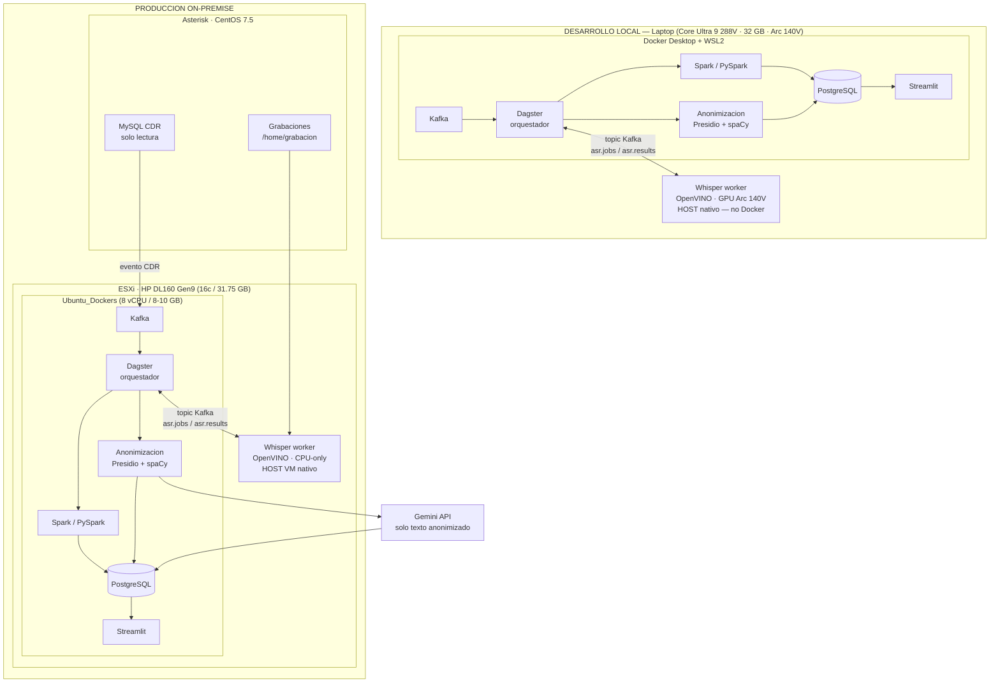
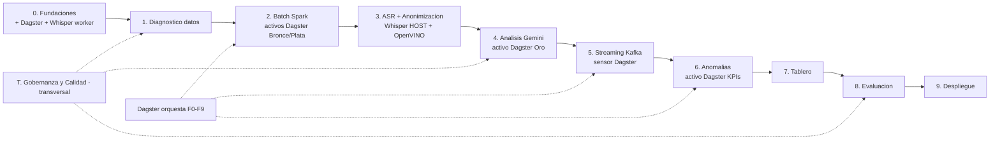
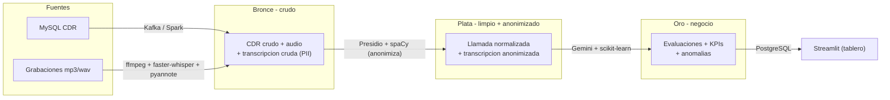

# Fases de Desarrollo — Implementación de la Solución

> **Proyecto:** Integración de analítica en tiempo real y LLMs para el análisis de
> grabaciones y CDR de call center (MKV / Diners Club).
> **Autor:** Carlos Enrique Miño Flores · Maestría en Big Data y Data Science (UISRAEL) · 2026.
>
> Este documento es mi **tracker maestro** de la implementación. Lo actualizo al
> avanzar/cerrar cada fase para saber, en cualquier reanudación, exactamente **dónde
> estoy y qué falta**. Cada fase la justifico con la metodología (DSR +
> CRISP-DM) y la ligo a los **objetivos específicos** del plan de titulación.

---

## Resumen

Tres diagramas para entender de un vistazo **la infraestructura**,
**las fases** y **las tecnologías/pipeline**.

### A) Infraestructura (on-premise + Gemini)

Todo lo sensible corre en la LAN; solo el **texto ya anonimizado** sale a la nube.
El desarrollo arranca en **local (laptop)** y luego se replica a la VM on-premise.



### B) Fases de implementación (batch primero, luego streaming)

Orden secuencial 0 → 9, con el **Componente transversal T** (Gobernanza y Calidad)
atravesando todas las fases.



| CRISP-DM | Fases |
|---|---|
| Comprensión del negocio / de los datos | 0, 1 |
| Preparación de datos | 2, 3 |
| Modelado | 4, 6 |
| Despliegue | 5, 7, 9 |
| Evaluación | 8 |
| Gobernanza y calidad (transversal) | T |

### C) Tecnologías y pipeline Medallion (Bronce → Plata → Oro)

Cada zona sube la calidad del dato; la **anonimización** es la frontera antes de Gemini.



| Etapa | Tecnología | Zona |
|---|---|---|
| Ingesta streaming | Apache Kafka | 🥉 |
| **Orquestación de workflows** | **Dagster** (Software-Defined Assets · linaje nativo · catálogo integrado) | todas |
| Procesamiento batch | Apache Spark / PySpark | 🥉🥈 |
| Normalización audio | ffmpeg | 🥉 |
| Transcripción + diarización | faster-whisper + WhisperX/pyannote · **OpenVINO** (aceleración Intel Arc/NPU en HOST) | 🥉 |
| Anonimización (frontera PII) | Presidio + spaCy | 🥉→🥈 |
| Análisis semántico | Gemini API (texto anonimizado) | 🥈→🥇 |
| Anomalías | scikit-learn (IsolationForest, autoencoders) | 🥇 |
| Capa servida | PostgreSQL | 🥇 |
| Tablero | Streamlit | — |
| Gobernanza y calidad | Great Expectations/pandera, pydantic, versionado | todas |

> **Nota — Dagster vs Airflow:** Se eligió Dagster sobre Apache Airflow (sugerido por el tutor) porque su
> paradigma de *Software-Defined Assets* se alinea directamente con la arquitectura Medallion: cada zona
> Bronce/Plata/Oro es un activo declarado con linaje, historial de materialización y catálogo integrado,
> cumpliendo de forma nativa los requisitos del Componente T (Gobernanza) sin instrumentación adicional.
> Airflow, orientado a tareas, requeriría herramientas externas para el mismo nivel de trazabilidad y
> consume ~3× más RAM (Redis + Celery + scheduler), crítico en la VM con 8–10 GB.
>
> **Nota — Whisper fuera de Docker:** Validado experimentalmente (2026-08-15): `/dev/dxg` (Intel DXCore)
> es accesible desde contenedores, pero el compute-runtime estándar de las imágenes Intel solo expone CPU.
> Whisper corre como **proceso nativo** en el host y se comunica con el pipeline via topics Kafka
> (`asr.jobs` / `asr.results`), usando OpenVINO para aprovechar el GPU Arc 140V (dev) o la CPU (prod).

> Detalle ampliado de cada pieza en [tecnologias.md](tecnologias.md), del flujo paso a
> paso en [pipeline.md](pipeline.md) y de la infraestructura/costos en
> [infraestructura.md](infraestructura.md).

---

## Marco metodológico (referencia rápida)

- **Design Science Research (DSR)** [Hevner, 2004]: ciclo *Relevancia → Diseño/Construcción → Evaluación → Rigor → Comunicación*. Cada fase declara a qué momento del DSR pertenece (construir un **artefacto** que resuelve un problema real y evaluarlo).
- **CRISP-DM** [Wirth & Hipp, 2000]: *Comprensión del negocio → Comprensión de los datos → Preparación → Modelado → Evaluación → Despliegue*. Guía el ciclo de datos y el pipeline.
- **Estrategia técnica:** **batch primero, luego streaming**; arquitectura híbrida (Lambda/Kappa) con **Kafka** (ingesta streaming) + **Spark** (batch) orquestados por **Dagster** (Software-Defined Assets / Medallion); **todo lo sensible on-premise** (ASR via Whisper+OpenVINO en HOST, anonimización, limpieza) y **solo texto anonimizado** hacia **Gemini** (sentimiento, rúbrica, métricas).

### Objetivos específicos (del plan) → fases

| Objetivo específico | Fases |
|---|---|
| OE1 Contextualizar (teoría ASR/LLM/tiempo real) | (cubierto en el plan) — soporte transversal |
| OE2 Diagnosticar proceso y datos (Asterisk/MySQL) | Fase 1 |
| OE3 Desarrollar arquitectura modular | Fases 0, 2, 3, 4, 5, 6, 7 |
| OE4 Validar impacto vs. auditoría manual | Fase 8 |
| (Despliegue y transferencia) | Fase 9 |

### Arquitectura de datos: Medallion (transversal a las fases)

El dato lo organizo en tres zonas de calidad creciente (detalle en
[pipeline.md](pipeline.md)). **No cambia el orden de las fases**; define *dónde vive*
el dato en cada una:

| Zona | Contenido | Se produce en |
|---|---|---|
| 🥉 **Bronce** | Crudo e inmutable (CDR, audio, transcripción cruda con PII) | Fases 1, 2, 3 |
| 🥈 **Plata** | Limpio, cruzado y **anonimizado** (1 fila = 1 llamada) | Fases 2, 3 |
| 🥇 **Oro** | KPIs, evaluaciones de rúbrica y anomalías (consumo) | Fases 4, 6, 7 |

> La **anonimización** ocurre en el paso Bronce→Plata: solo Plata/Oro salen a Gemini.
> Batch y streaming escriben las **mismas zonas** (capa servida única).

### Justificación Big Data (las «V») y arquitectura completa

Justifico el carácter Big Data **no solo por Volumen** sino por las dimensiones que
realmente aplican a mi caso (responde a la observación del tutor; detalle en
[observaciones.md](observaciones.md)):

| Dimensión | Cómo la argumento |
|---|---|
| **Variety** (la más fuerte) | Voz **no estructurada** + CDR **estructurado** + texto derivado → problema **multimodal** [ref. 12] |
| **Velocity** | **Flujo continuo** de eventos (cada llamada al colgar) procesado *near-real-time* |
| **Veracity** | Alucinaciones de ASR [ref. 6], calidad/trazabilidad y anonimización → exige gobernanza |
| **Value** | KPIs de negocio + reducción de **riesgo regulatorio** (multas Superintendencia) |
| **Volume** | Stream de producción que **crece indefinidamente** + datos derivados + **ASR compute-bound** |

**Argumento central:** una sola máquina *podría* procesar los 100 GB una vez, pero **no
garantiza** ingesta continua sin pérdida, tolerancia a fallos, reprocesamiento ni
**escalabilidad horizontal** en un sistema que opera en producción de forma permanente.

**Bloques de la arquitectura Big Data (explícitos):**

| Bloque exigido | Componente en mi solución |
|---|---|
| Ingesta distribuida | Apache **Kafka** (evento por llamada) |
| Almacenamiento masivo / Data Lake | **Medallion** (MinIO/Parquet → S3 en nube) |
| Procesamiento paralelo | **Spark / PySpark** con speedup medido |
| Gobernanza y calidad de datos | Capa transversal (ver abajo) |
| Analítica y consumo | LLM como etapa del pipeline + anomalías + PostgreSQL + tablero |

> El **LLM se integra dentro del ciclo Big Data**: consume la zona **Plata** (texto
> anonimizado) y produce la zona **Oro** (evaluaciones estructuradas), como una etapa
> más del pipeline gobernado, no como pieza aislada.

---

## Infraestructura

### Entorno de desarrollo local (primer objetivo — arrancar mañana)

| Spec | Valor |
|---|---|
| CPU | Intel Core Ultra 9 288V · 8 cores · 3.30 GHz · Lunar Lake |
| RAM | 32 GB LPDDR5 · 8533 MT/s |
| GPU | Intel Arc(TM) 140V · 16 GB memoria compartida · OpenVINO en HOST |
| NPU | Intel AI Boost · OpenVINO opcional para Whisper |
| Docker | Desktop 29.7.2 · WSL2 2.6.3 · kernel 6.6.87 |
| Driver Arc | 32.0.101.8724 (abril 2026) · `/dev/dxg` disponible en WSL2 |

- **Stack Docker local:** Kafka + Dagster + Spark + PostgreSQL + Streamlit (perfiles `dev`/`prod`).
- **Whisper worker:** proceso Python nativo en el host, OpenVINO + Intel Arc GPU. Se conecta al pipeline via topics Kafka (`asr.jobs` / `asr.results`). No corre dentro de Docker (limitación de compute-runtime validada 2026-08-15).
- **Datos de desarrollo:** muestra local de CDR (MySQL via VPN o volcado) + subconjunto de grabaciones copiadas.

### Entorno de producción on-premise (objetivo final)

- **Host ESXi:** HP ProLiant DL160 Gen9 — 16 cores Xeon E5-2609 v4, 31.75 GB RAM, datastore 1.81 TB (709 GB libres). **CPU ~5 % usado (ocioso); RAM ~89 % usada (recurso crítico).**
- **VM `Ubuntu_Dockers`:** objetivo **8 vCPU + 8–10 GB RAM** (liberar `Ubuntu_Temporal` + apagar `ProperTime`). Sin GPU → Whisper **CPU-only** via OpenVINO sobre muestra representativa.
- **Stack prod:** mismo `docker-compose.yml` que dev (perfil `prod`) + Whisper worker nativo en la VM.
- **Fuente de datos:** MySQL CDR de producción (solo lectura) + grabaciones en `/home/grabacion/monitor/111111111111/`.
- **Regla de oro:** todo sensible permanece on-premise; solo texto anonimizado (zona Plata) sale a Gemini.

---

## Tablero de estado global

Leyenda: ⬜ No iniciada · 🟨 En progreso · ✅ Completada

| Fase | Nombre | CRISP-DM | Estado |
|---|---|---|---|
| 0 | Fundaciones e infraestructura | Comprensión del negocio | ⬜ |
| 1 | Diagnóstico y comprensión de datos | Comprensión de los datos | ⬜ |
| 2 | Preparación batch (Spark) | Preparación de datos | ⬜ |
| 3 | ASR + anonimización (local) | Preparación de datos | ⬜ |
| 4 | Análisis de calidad y cumplimiento (Gemini) | Modelado | ⬜ |
| 5 | Ingesta streaming near-real-time (Kafka) | Despliegue (parcial) | ⬜ |
| 6 | Anomalías y rendimiento por agente | Modelado | ⬜ |
| 7 | Capa servida + tablero analítico | Despliegue | ⬜ |
| 8 | Evaluación vs. línea base | Evaluación | ⬜ |
| 9 | Despliegue on-premise + capacitación | Despliegue | ⬜ |
| **T** | **Gobernanza y calidad de datos (transversal)** | Todas | ⬜ |

---

## Componente transversal T — Gobernanza y Calidad de Datos

**Objetivo:** garantizar **calidad, trazabilidad, reproducibilidad y privacidad** del dato
a lo largo de todo el pipeline. No es una fase secuencial: **atraviesa las Fases 1–9**.
Las decisiones fundacionales están fijadas en la **carta de gobernanza**
([gobernanza.md](gobernanza.md)).

> **Ojo — dos «calidades» distintas:** *calidad de la VENTA* (negocio) = rúbrica
> [proyecto/parametros_calidad_empresa.md](proyecto/parametros_calidad_empresa.md);
> *calidad del DATO* (técnica) = este componente. La gobernanza además **versiona** la rúbrica.

**Justificación metodológica:** DSR → *Rigor* (confiabilidad y reproducibilidad del
artefacto). CRISP-DM → transversal a *Comprensión/Preparación/Modelado/Evaluación*.
Refuerza el requisito de **privacidad y trazabilidad** del plan.

**Hitos / pasos:**
- [ ] **Calidad de datos automática** en cada frontera de zona (Bronce→Plata→Oro) con
  **Great Expectations / pandera**: esquemas, tipos, rangos, nulos, **unicidad de
  `call_id`**, cobertura del cruce CDR↔grabación, duración válida.
- [ ] **Contratos de datos** (esquemas versionados con `pydantic`) entre etapas del pipeline.
- [ ] **Catálogo + linaje**: registrar de dónde viene cada dato (Bronce) y en qué se
  transforma (Plata/Oro), con metadatos por llamada (modelo ASR, versión de rúbrica, fecha).
- [ ] **Versionado**: rúbrica (`rubrica_v1/v2`), modelos y datasets/gold set
  (**DVC/lakeFS** opcional).
- [ ] **Privacidad como gobernanza**: auditoría de anonimización, control de acceso a
  Bronce (dato crudo), política de retención.
- [ ] **Reproducibilidad**: contenedores + dependencias fijadas + **semillas** + ejecuciones
  parametrizadas por rango de fechas.

**Checklist de validación:**
- [ ] Un lote que viola el esquema es **rechazado y reportado** por las validaciones.
- [ ] Puedo **reconstruir** cualquier registro Oro trazándolo hasta su Bronce (linaje).
- [ ] Cambiar la rúbrica genera una **nueva versión** sin sobrescribir resultados previos.
- [ ] Una ejecución con la misma semilla y parámetros **produce el mismo resultado**.

**Entregable:** capa de gobernanza y calidad operativa (reportes de calidad + catálogo/
linaje + versionado), integrada en el pipeline.

---

## Fase 0 — Fundaciones e infraestructura

**Objetivo:** dejar el entorno local y la arquitectura base completamente operativos y reproducibles. Arrancar en el **laptop de desarrollo** (Core Ultra 9 / Arc 140V) y preparar la misma configuración para la VM on-premise.

**Justificación metodológica:** DSR → establece el *entorno* donde vivirá el artefacto (rigor). CRISP-DM → *Comprensión del negocio* (preparar herramientas y alcance). Dagster formaliza el pipeline desde el primer commit.

**Hitos / pasos:**

**0.A — Repositorio y estructura**
- [ ] Crear estructura del monorepo:
  ```
  src/
    ingestion/       # conectores CDR (MySQL) + productor Kafka
    processing/      # jobs Spark batch + activos Dagster Bronce/Plata
    asr/             # Whisper worker nativo (OpenVINO) — no Docker
    anonymization/   # Presidio + spaCy + regex custom
    analysis/        # cliente Gemini + rúbrica + pydantic
    anomalies/       # IsolationForest + series temporales
    serving/         # modelos PostgreSQL + vistas
    dashboard/       # Streamlit
  infra/
    docker-compose.yml   # Kafka + Dagster + PostgreSQL + Streamlit
    docker-compose.override.yml  # overrides dev
    Dockerfiles/
    dagster/         # dagster.yaml, workspace.yaml
  whisper_worker/    # proceso nativo host (fuera de Docker)
    requirements.txt # faster-whisper, openvino, pyannote
    worker.py        # lee topic asr.jobs, publica asr.results
  notebooks/
  tests/
  docs/
  data/              # gitignored — muestras locales
  ```
- [ ] `.env` para variables de entorno (DB, Kafka bootstrap, Gemini key). Mover `.gemini_key` aquí; nunca en git.
- [ ] `pre-commit` con ruff/black + `git grep` para secretos.
- [ ] `README.md` técnico del repo con instrucciones de arranque en una línea.

**0.B — Docker Compose con Dagster**
- [ ] `docker-compose.yml` con:
  - **Kafka** (Confluent `cp-kafka` 7.x) + Zookeeper o KRaft mode
  - **Dagster** (dagster-webserver + dagster-daemon + PostgreSQL como backend de metadatos)
  - **PostgreSQL** (capa servida, distinto del backend Dagster)
  - **Streamlit** (placeholder)
  - Topics iniciales: `llamadas.finalizadas`, `asr.jobs`, `asr.results`, `transcripciones`, `anonimizadas`, `analisis.calidad`
- [ ] Perfiles `dev` (volúmenes locales, logs verbosos) y `prod` (restart: always, recursos limitados).
- [ ] `healthcheck` para cada servicio crítico.
- [ ] Dagster `workspace.yaml` apuntando a `src/` como módulo de activos.

**0.C — Dagster: primer DAG esqueleto**
- [ ] Definir los **activos Dagster** que mapean las zonas Medallion:
  ```python
  @asset  bronze_cdr          # lee MySQL → Parquet bronce
  @asset  bronze_audio_index  # índice filesystem grabaciones
  @asset  silver_calls        # cruce CDR↔audio + normalización
  @asset  silver_transcriptions  # resultado Whisper worker (via asr.results)
  @asset  gold_evaluations    # resultado Gemini
  @asset  gold_kpis           # agregados + anomalías
  ```
- [ ] Particionado por fecha (`DailyPartitionsDefinition`) para habilitar backfill histórico.
- [ ] Job `batch_pipeline` que materializa Bronce → Plata → Oro.
- [ ] Sensor `new_calls_sensor` que detecta CDR nuevos y lanza el job (streaming path).

**0.D — Whisper worker nativo (host)**
- [ ] Crear `whisper_worker/` con entorno Python dedicado (`requirements.txt`).
- [ ] Instalar: `faster-whisper`, `openvino`, `openvino-dev`, `pyannote.audio`, `confluent-kafka`.
- [ ] `worker.py`: consume topic `asr.jobs` (mensaje: `{call_id, audio_path}`), transcribe con OpenVINO + faster-whisper, diariza, publica resultado en `asr.results`.
- [ ] Validar que OpenVINO detecta el GPU Arc 140V en el host:
  ```python
  from openvino.runtime import Core
  print(Core().available_devices)  # esperado: ['CPU', 'GPU'] o ['CPU', 'GPU.0']
  ```
- [ ] Script de inicio: `start_whisper_worker.sh` (o `.ps1` en Windows).

**0.E — Validación del entorno**
- [ ] `docker compose up -d` levanta todos los servicios sin errores.
- [ ] `dagster dev` (o `dagster-webserver`) muestra el grafo de activos en UI.
- [ ] Un mensaje de prueba llega de Kafka → Dagster → se procesa → se almacena en PostgreSQL.
- [ ] El Whisper worker procesa un audio de prueba de 30 s y devuelve transcripción en `asr.results`.
- [ ] OpenVINO reporta GPU disponible en el host (Arc 140V).
- [ ] El repo no contiene secretos (`pre-commit` + `git grep -r "AKIA\|sk-\|AIza" .`).

**Checklist de validación:**
- [ ] `docker compose ps` — todos `healthy`.
- [ ] Dagster UI en `localhost:3000` muestra activos `bronze_cdr`, `silver_calls`, `gold_evaluations`.
- [ ] `nproc` y `free -h` en la VM muestran ≥ 8 cores y ≥ 8 GB libres (cuando aplique en prod).
- [ ] Audio de prueba → transcripción correcta en menos de 3× duración del audio (en laptop con Arc).
- [ ] Sin secretos en git.

**Entregable:** monorepo funcionando localmente con Dagster + Kafka + PostgreSQL + Whisper worker nativo — levantable en una línea de comando.

---

## Fase 1 — Diagnóstico y comprensión de datos

**Objetivo:** entender y perfilar CDR y grabaciones, y **resolver el enlace CDR↔grabación**.

**Justificación metodológica:** DSR → *Relevancia* (caracterizar el problema real). CRISP-DM → *Comprensión de los datos*. Cubre **OE2 (Diagnosticar)**.

**Hitos / pasos:**
- [ ] Definir el activo Dagster `bronze_cdr` como primera materialización (consulta MySQL por rango de fechas → Parquet).
- [ ] Conector **solo lectura** a MySQL CDR (forzar decodificación **latin1→UTF-8** para acentos).
- [ ] Perfilado del CDR: volúmenes por año, distribución de `duration`/`billsec`, `disposition` (contactabilidad), agentes (`src`), destinos (`dst`), calidad de campos.
- [ ] Analizar `pregunta1/2/3` (respuestas IVR/encuesta) y su utilidad como señal.
- [ ] **Enlace grabación — camino determinístico (≤ 2023-06-12):** parsear `urlrecord`
  (`http://192.168.0.40/monitor/111111111111/{ext}/OUT/{ts}-{ext}-{seq}.mp3`) →
  ruta local `/home/grabacion/monitor/111111111111/...`.
- [ ] **Enlace grabación — camino reconstruido (> 2023-06-12, `urlrecord` vacío):**
  construir un **índice del filesystem** (walk recursivo de `.mp3` y `.wav`), parsear
  nombres `{YYYYMMDDHHmmss}-{ext}-{seq}`, y emparejar con CDR por `(timestamp≈calldate, ext=src)`.
- [ ] Manejar **archivos regados** (no siempre bajo `{ext}/OUT/`) con el índice global.
- [ ] Reporte de **tasa de emparejamiento**: % con `urlrecord`, % reconstruidos, % huérfanos (CDR sin audio / audio sin CDR), % `wav` sin convertir.
- [ ] Definir criterios de **muestra representativa** (rango de fechas + duración mín/máx) para el resto del proyecto.

**Checklist de validación:**
- [ ] Los acentos del español se leen correctamente (no *mojibake*).
- [ ] Para una muestra de 50 CDR con `urlrecord`, el archivo existe en disco (verificación 1:1).
- [ ] Para una muestra > 2023-06-12, el reconstructor encuentra el audio correcto (validado a oído en 10 casos).
- [ ] Reporte de diagnóstico generado con métricas de cobertura y calidad.
- [ ] Definida y documentada la muestra (criterios reproducibles).

**Entregable:** informe de diagnóstico de datos + módulo de **resolución de enlace CDR↔grabación** + activo Dagster `bronze_audio_index` + dataset de muestra emparejado y trazable.

---

## Fase 2 — Preparación batch (Spark / PySpark)

**Objetivo:** pipeline batch reproducible que limpia, cruza y normaliza el histórico por **rango de fechas**.

**Justificación metodológica:** DSR → *Construcción del artefacto* (camino batch de la arquitectura híbrida). CRISP-DM → *Preparación de datos*. Cubre **OE3**. Los jobs Spark son activos Dagster particionados por fecha, habilitando backfill histórico y linaje nativo.

**Hitos / pasos:**
- [ ] Activos Dagster `silver_calls` (Bronce→Plata) particionado por día. Job `batch_pipeline` materializa el rango.
- [ ] Job **PySpark** parametrizado por rango de fechas que lee CDR (JDBC) + índice de grabaciones.
- [ ] Limpieza y normalización: tipos, teléfonos, deduplicado, `disposition` canónica.
- [ ] Cruce CDR↔grabación a escala (reutiliza el resolvedor de la Fase 1).
- [ ] Filtrado de la muestra por criterios de duración (descartar fallidas/anómalas).
- [ ] **Normalización de audio**: convertir a formato estándar para ASR (mono, 16 kHz, WAV/PCM) con `ffmpeg`, incluyendo los `wav` que nunca se convirtieron a mp3.
- [ ] Definir el **modelo de datos de la capa servida** (esquema en PostgreSQL: `llamadas`, `transcripciones`, `evaluaciones`, `agentes`, `kpis`).
- [ ] Escribir resultados intermedios (Parquet) + tabla `llamadas` base.
- [ ] **Calidad de datos** (Great Expectations/pandera) en la frontera Bronce→Plata: esquema, nulos, unicidad de `call_id`, cobertura del cruce (ver Componente transversal T).
- [ ] **Criterios de escalabilidad**: ejecutar el mismo job variando núcleos/particiones y registrar el **speedup** (strong/weak scaling) como evidencia distribuida.

**Checklist de validación:**
- [ ] El job corre por un rango (p. ej. un mes) y produce salida consistente y repetible.
- [ ] Conteos cuadran (CDR en rango = procesados + descartados con motivo).
- [ ] Los audios normalizados abren y tienen 16 kHz mono.
- [ ] Medición de **speedup** al variar núcleos/particiones (evidencia de escalabilidad para el tribunal).
- [ ] Las validaciones de calidad rechazan y reportan lotes que no cumplen el esquema.

**Entregable:** activos Dagster `bronze_cdr`, `silver_calls` operativos con linaje + pipeline batch parametrizable + capa de datos base poblada con una muestra.

---

## Fase 3 — ASR + anonimización (100 % local, GPU acelerado)

**Objetivo:** de audio → **transcripción diarizada y anonimizada** sin que el audio ni los datos personales salgan de la LAN. El módulo de transcripción corre en el **host nativo** (OpenVINO + Intel Arc en dev; OpenVINO CPU en prod) y se integra al pipeline via Kafka.

**Justificación metodológica:** DSR → *Construcción* (módulo de privacidad por diseño). CRISP-DM → *Preparación de datos*. Cubre **OE3** y el requisito de privacidad del plan. La decisión de correr Whisper fuera de Docker se fundamenta en la limitación validada del compute-runtime Intel en contenedores (2026-08-15).

**Arquitectura del módulo:**
```
Dagster activo silver_transcriptions
  → publica job en topic  asr.jobs  {call_id, audio_path}
  ← consume resultado de  asr.results  {call_id, transcript_anon, metadata}

Whisper worker (HOST nativo, fuera de Docker):
  audio_path → ffmpeg (normalización) → faster-whisper (OpenVINO)
             → pyannote (diarización) → anti-alucinación → Presidio+spaCy
             → transcript_anon → publica en asr.results
```

**Hitos / pasos:**
- [ ] **Whisper worker** ya levantado en Fase 0; aquí se completa y prueba con datos reales.
- [ ] Modelo faster-whisper: `small` (dev/muestra) o `medium` (prod/calidad); cuantización **int8** via OpenVINO.
- [ ] Validar que OpenVINO usa el GPU Arc 140V: `Core().available_devices` debe incluir `GPU`.
- [ ] **Diarización** agente/cliente (canal mono compartido) con `WhisperX` / `pyannote.audio` v3.
- [ ] Verificación **anti-alucinación**: descartar segmentos con `no_speech_prob > 0.6` o repeticiones detectadas por ventana deslizante.
- [ ] **Anonimización** (`Presidio` + reconocedores propios):
  - Cédula ecuatoriana (10 dígitos, validación módulo 10)
  - Número de tarjeta (16 dígitos, Luhn)
  - Teléfonos Ecuador (09xxxxxxxx, 02/03/04-xxxxxxx)
  - Montos y referencias financieras
  - spaCy ES NER para nombres propios
- [ ] Guardar **transcripción cruda cifrada/local** (bronce) y **transcripción anonimizada** (plata, única que sale a Gemini).
- [ ] Registrar metadatos del activo Dagster: `{call_id, model, model_version, openvino_device, wer_proxy, duration_s, process_time_s, anon_entities_found, run_date}`.
- [ ] Esquema de salida validado con `pydantic` antes de publicar en `asr.results`.

**Checklist de validación:**
- [ ] OpenVINO reporta `GPU` en `available_devices` en el host (dev); `CPU` aceptable en prod.
- [ ] WER cualitativo ≤ umbral acordado en 10 llamadas revisadas a oído.
- [ ] Diarización separa correctamente asesor/cliente en la muestra (verificado manualmente en 5 llamadas).
- [ ] **0 fugas de PII**: en 30 transcripciones anonimizadas no aparece ninguna cédula/tarjeta/teléfono/nombre real.
- [ ] El activo `silver_transcriptions` se materializa correctamente en Dagster UI.
- [ ] Audio crudo nunca abandona la LAN (no hay salidas de red con audio en logs de red).
- [ ] Tiempo de proceso < 3× duración del audio en el laptop (Arc GPU); documentado como métrica de throughput.

**Entregable:** Whisper worker nativo + activo Dagster `silver_transcriptions` integrado al pipeline — de audio a transcripción anonimizada en zona Plata.

---

## Fase 4 — Análisis de calidad y cumplimiento (Gemini)

**Objetivo:** etiquetar cada llamada según la **rúbrica de la empresa** (calidad, cumplimiento, sentimiento) usando Gemini sobre texto anonimizado.

**Justificación metodológica:** DSR → *Construcción* (núcleo analítico). CRISP-DM → *Modelado*. Cubre **OE3**; habilita las métricas de **OE4**.

**Definición formal del modelo (Familia A — clasificación de calidad/cumplimiento por llamada):**
- *Entrada:* transcripción anonimizada y diarizada + variables del CDR.
- *Técnica:* LLM (Gemini) con la rúbrica + reglas deterministas + *fuzzy-match* de descargos legales exactos.
- *Salida:* vector de criterios A/B/C, `calidad_score`, `venta_valida` (regla dura), `riesgo_reclamo`, sentimiento.
- *Métricas:* **Accuracy, Precision, Recall, F1** contra el *gold set*.

**Hitos / pasos:**
- [ ] Activo Dagster `gold_evaluations` (dep: `silver_transcriptions`) — materialización en zona Oro.
- [ ] Implementar `rubrica_v1` (`proyecto/parametros_calidad_empresa.md`): Grupo A (script), B (palabras prohibidas), C (omisiones), severidades CRÍTICA/MAYOR/MENOR.
- [ ] Prompt(s) a **Gemini** con salida **JSON estructurada** (esquema de `guia_etiquetado_calidad.md`): criterios, `calidad_score`, `venta_valida` (regla dura), `riesgo_reclamo`, sentimiento del asesor y trayectoria del cliente.
- [ ] Detección híbrida: `fuzzy-match` local para descargos legales exactos (A07/C05) + juicio de Gemini para el resto.
- [ ] **Weak supervision / gold set**: muestreo estratificado + revisión de un auditor (`humano_confirmada`/`humano_corregida`); versionado de rúbrica.
- [ ] Persistir `evaluaciones` en la capa servida con trazabilidad (call_id, versión, modelo, fecha, `confianza_llm`).

**Checklist de validación:**
- [ ] Salida siempre es JSON válido conforme al esquema (validación con `pydantic`).
- [ ] `venta_valida = 0` se dispara ante cualquier infracción CRÍTICA (probado con casos sintéticos).
- [ ] Gold set inicial (≥ N llamadas) revisado por humano y almacenado.
- [ ] Concordancia auditor↔LLM medida (Accuracy/Recall/F1 preliminar).

**Entregable:** etiquetado automático de calidad por llamada + gold set + métricas preliminares vs. auditoría.

---

## Fase 5 — Ingesta streaming near-real-time (Kafka)

**Objetivo:** que una **llamada nueva** fluya automáticamente (CDR nuevo → audio → ASR → anonimización → análisis → capa servida) casi en tiempo real.

**Justificación metodológica:** DSR → *Construcción* (camino streaming). CRISP-DM → *Despliegue* (parcial). Cubre **OE3**; cierra la arquitectura híbrida.

**Hitos / pasos:**
- [ ] **Sensor Dagster** `new_calls_sensor`: detecta CDR nuevos en MySQL y lanza materialización incremental de `bronze_cdr` → desencadena el pipeline completo.
- [ ] Detector de llamadas nuevas: **polling incremental** del CDR por `calldate`/`uniqueid` (no hay escritura en Asterisk) → productor Kafka `llamadas.finalizadas`.
- [ ] Consumidores encadenados (topics: `transcripciones`, `anonimizadas`, `analisis.calidad`) **reutilizando los módulos de Fases 3–4**.
- [ ] Garantías: *offsets*, reintentos, *idempotencia* (no reprocesar la misma llamada).
- [ ] Unificar el **mismo modelo de datos** batch y streaming (consistencia).

**Checklist de validación:**
- [ ] Una llamada de prueba recién finalizada aparece analizada en la capa servida sin intervención manual.
- [ ] Si un consumidor cae y se reinicia, retoma sin perder ni duplicar (prueba de resiliencia).
- [ ] Latencia extremo-a-extremo por llamada medida y documentada.

**Entregable:** pipeline streaming operativo end-to-end sobre datos reales.

---

## Fase 6 — Anomalías y rendimiento por agente

**Objetivo:** agregar indicadores por agente/periodo y **detectar anomalías** de rendimiento (no supervisado) + predecir KPIs.

**Justificación metodológica:** DSR → *Construcción*. CRISP-DM → *Modelado*. Cubre **OE3**.

**Definición formal del modelo (Familia B — anomalías y pronóstico por agente/periodo):**
- *Variables (explícitas):* tasa de contactabilidad, tasa de conversión, calidad media, `% ventas válidas`, duración media, `% sentimiento negativo`, volumen de llamadas, franja horaria.
- *Técnicas:* **Isolation Forest**, **autoencoders** [ref. 15] y **z-score** (no supervisado); **series temporales** [ref. 16] para el pronóstico de KPIs.
- *Validación:* confirmación humana de casos marcados + `precision@k`; comparación con el histórico del propio agente y del grupo.

**Hitos / pasos:**
- [ ] Activo Dagster `gold_kpis` (dep: `gold_evaluations`) — agrega por agente/ventana temporal, escribe en PostgreSQL.
- [ ] Agregados por agente y ventana (día/semana): contactabilidad, conversión, calidad media, `pct_ventas_validas`, duración media, sentimiento negativo.
- [ ] Detección de anomalías **no supervisada**: `IsolationForest` / z-score (scikit-learn) sobre histórico del agente y del grupo.
- [ ] Predicción de KPIs (series temporales) para horarios/días de mayor efectividad.
- [ ] Confirmación humana de anomalías marcadas (bucle de retroalimentación).

**Checklist de validación:**
- [ ] Los agregados coinciden con cálculos manuales en una muestra.
- [ ] Las anomalías marcadas son plausibles al revisar casos concretos.
- [ ] Recomendación de horarios/días respaldada por los datos.

**Entregable:** módulo de rendimiento + alertas de anomalías por agente.

---

## Fase 7 — Capa servida + tablero analítico

**Objetivo:** consolidar indicadores y exponer el **tablero** para gerencia/auditoría/agentes.

**Justificación metodológica:** DSR → *Construcción* + inicio de *Comunicación*. CRISP-DM → *Despliegue*. Cubre **OE3**; base de **OE4**.

**Hitos / pasos:**
- [ ] Modelo servido final en PostgreSQL (tablas/vistas para KPIs).
- [ ] **Tablero** (Streamlit como opción ligera; alternativa Metabase/Superset): calidad, contactabilidad, conversión, rendimiento por agente, horarios óptimos, **alertas** de prácticas críticas.
- [ ] Vistas por rol (gerencia / auditoría / retroalimentación al agente).
- [ ] Filtros por fecha, agente, tipo de infracción.

**Checklist de validación:**
- [ ] El tablero carga y refleja los datos de la capa servida.
- [ ] Los números del tablero cuadran con consultas SQL directas.
- [ ] Un usuario no técnico interpreta los indicadores en una prueba de usabilidad.

**Entregable:** tablero analítico funcional conectado al pipeline.

---

## Fase 8 — Evaluación vs. línea base

**Objetivo:** medir el desempeño del artefacto y **compararlo con la auditoría manual**.

**Justificación metodológica:** DSR → *Evaluación* (rigor del artefacto). CRISP-DM → *Evaluación*. Cubre **OE4** (validación) y sustenta la hipótesis.

**Hitos / pasos:**
- [ ] Métricas del modelo contra el **gold set**: Accuracy, Precision, Recall, F1.
- [ ] KPIs de negocio (contactabilidad, conversión, duración) + horarios/días.
- [ ] Métricas operativas: tiempo por llamada, **throughput**, speedup de Spark.
- [ ] Comparación **antes/después** vs. auditoría manual: cobertura, tiempo de detección de anomalías, consistencia.
- [ ] **Pruebas estadísticas** (SciPy/statsmodels) para respaldar la mejora (significancia).

**Checklist de validación:**
- [ ] Resultados reproducibles (semillas, versiones de rúbrica fijadas).
- [ ] Las pruebas estadísticas respaldan (o refutan) la hipótesis con evidencia.
- [ ] Tabla comparativa manual vs. automático completa.

**Entregable:** informe de resultados y validación (capítulo de la tesis).

---

## Fase 9 — Despliegue on-premise + capacitación

**Objetivo:** poner la solución en producción en la LAN de la empresa y transferir conocimiento.

**Justificación metodológica:** DSR → *Comunicación* y contribución. CRISP-DM → *Despliegue*. Cubre el compromiso de vinculación y beneficiarios del plan.

**Hitos / pasos:**
- [ ] Perfil `prod` de Docker Compose; arranque automático (systemd/`restart: always`).
- [ ] Monitoreo básico (salud de servicios, *lag* de Kafka, errores) y respaldos de la BD.
- [ ] Hardening: red segmentada, credenciales de solo lectura, gestión de secretos.
- [ ] Documentación de operación + manual del tablero.
- [ ] **Capacitación** a directivos, auditoría/calidad y gerentes (uso del tablero, alertas).

**Checklist de validación:**
- [ ] El sistema se recupera solo tras un reinicio de la VM.
- [ ] Procesa llamadas reales de forma continua durante un periodo de prueba.
- [ ] El equipo de la empresa opera el tablero de forma autónoma tras la capacitación.

**Entregable:** solución en operación on-premise + documentación + capacitación realizada.

---

## Registro de avance (bitácora)

> Añadir una línea por sesión: fecha · fase · qué se hizo · qué sigue.

- _2026-08-14 · Fase 0 (previo) · Definición de fases, hardware y estrategia. Transcripción del plan y `fases.md` creados. Siguiente: ejecutar Fase 0 (dimensionar VM + scaffold + docker-compose)._
- _2026-08-14 · Ajuste por observación del tutor · Agregada la justificación Big Data por las «V», el Componente transversal T (Gobernanza y Calidad), criterios de escalabilidad (Fase 2) y la definición formal de los modelos (Familias A y B, Fases 4 y 6). Ver [observaciones.md](observaciones.md). Pendiente: nuevo documento del plan con el reencuadre y decisión del nuevo título._
- _2026-08-14 · Gobernanza definida · Creada la carta [gobernanza.md](gobernanza.md) (claves `uniqueid`/`linkedid`, retención por sensibilidad LOPDP, acceso solo autor, pandera inline, versionado carpeta/fecha, umbral cruce ≥ 95 % + precisión linkage). Añadidas 2 referencias al `.bib` (batini2009, christen2012). Enlazada como entregable de Fase 0._
- _2026-08-15 · Reunión con tutor + decisiones arquitectónicas · **Tutor aprobó el plan** con observación de orquestación. Decisiones cerradas: (1) Dagster como orquestador (sobre Airflow por alineación nativa con Medallion + menor RAM + linaje integrado); (2) arquitectura híbrida validada: Docker para Kafka/Dagster/Spark/PostgreSQL/Streamlit, Whisper worker nativo en HOST via OpenVINO; (3) desarrollar localmente en laptop (Core Ultra 9 / Arc 140V) antes de desplegar en VM ESXi. Validado experimentalmente: `/dev/dxg` pasa a Docker pero compute-runtime estándar Intel solo expone CPU — Whisper corre fuera de Docker._
- _2026-08-16 · **INICIO IMPLEMENTACIÓN — Fase 0** · Fases actualizadas con Dagster, arquitectura híbrida Whisper HOST+OpenVINO, estructura monorepo, DAG Dagster esqueleto, configuración docker-compose con Dagster. Próximo paso: crear monorepo, docker-compose, primer activo Dagster, validar Whisper worker con OpenVINO en Arc 140V._
