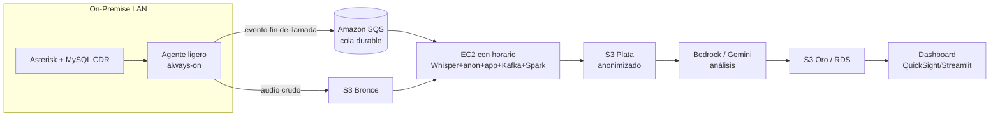

# Infraestructura — Estado actual, brechas y comparativa On-Premise vs. AWS

> Documento de decisión de infraestructura para el proyecto de titulación.
> Complementa [fases.md](fases.md) y [plan_titulacion.md](plan_titulacion.md).
> **Fecha de análisis:** agosto 2026. **Los precios de AWS son aproximados** (precios
> de lista *on-demand*, región `us-east-1`) y deben validarse en el
> [AWS Pricing Calculator](https://calculator.aws) antes de contratar.

---

## 1. Lo que tengo actualmente (on-premise)

### Servidor físico (host de virtualización)
| Recurso | Detalle |
|---|---|
| Modelo | HP ProLiant DL160 Gen9 (chasis **1U**) |
| CPU | 16 cores — Intel Xeon **E5-2609 v4 @ 1.70 GHz** (gama baja: sin *turbo*, sin *hyper-threading*) |
| RAM | **31.75 GB** total |
| Almacenamiento | Datastore VMFS5 de **1.81 TB** (~**709 GB libres**) |
| Hipervisor | **VMware ESXi 6.0** (fin de soporte) |
| GPU | **Ninguna** |

### Uso actual del host
- **CPU: ~5 % usado** (1.4 de 27.2 GHz) → **hay CPU de sobra**.
- **RAM: ~89 % usada** (3.55 GB libres) → **la RAM es el recurso crítico**.
- **Almacenamiento: 62 % usado** (709 GB libres) → suficiente para el proyecto.

### Máquinas virtuales
| VM | RAM consumida | Disco | Acción |
|---|---|---|---|
| Server2012 | 3.92 GB | 106 GB | Producción (no tocar) |
| ProperTime | 1.46 GB | 82 GB | **Apagar** (ya no se usa) |
| Ubiquiti | 0 (apagada) | 20 GB | — |
| UbuntuMve05032019 | 2.2 GB | 206 GB | Producción (no tocar) |
| ServidorD3Vip | 6.17 GB | 79 GB | Producción (no tocar) |
| Server2016R | 7.53 GB | 108 GB | Producción (no tocar) |
| **Ubuntu_Dockers** | 3.34 GB | 19 GB | **Nuestra VM de trabajo** |
| Ubuntu_Temporal | 1.47 GB | 10 GB | **Eliminar** |

### Fuente de datos (otro servidor en la misma LAN)
- **Asterisk 13.23.1** sobre **CentOS 7.5** (2018, EOL).
- **MySQL** con la tabla `cdr` (acceso **solo lectura** a producción, en tiempo real).
- Grabaciones en `/home/grabacion/monitor/111111111111/` (accesibles desde la VM Docker).

---

## 2. Plan realista con lo que tengo (sin comprar nada)

Como sobra CPU y falta RAM, liberamos memoria y reasignamos:

1. **Eliminar** `Ubuntu_Temporal` → libera ~1.5 GB RAM + 10 GB disco.
2. **Apagar** `ProperTime` → libera ~1.5 GB RAM.
3. **Reconfigurar `Ubuntu_Dockers`:** **8 vCPU** + **8–10 GB RAM** (con *memory reservation* para evitar *ballooning*/swapping durante el ASR).

Con esto el stack corre en modo **CPU-only sobre una muestra representativa**, delegando el análisis semántico pesado a **Gemini** (texto ya anonimizado). Es viable para la tesis y para producción a la escala actual de llamadas.

---

## 3. Lo que me falta para tener "buenas especificaciones"

| Brecha | Impacto | Opción de mejora | Costo aprox. |
|---|---|---|---|
| **RAM del host** (31.75 GB compartidos) | No permite Whisper `medium`/`large` + LLM local grande | Añadir **2×32 GB DDR4 ECC RDIMM** (el DL160 Gen9 tiene 8 slots, admite mucho más) | ~US$120–250 (una vez) |
| **Sin GPU** | ASR en CPU es lento (viable solo en muestra) | GPU no cabe bien en 1U + ESXi 6.0 *passthrough* viejo; **no recomendado** | (descartado) |
| **CPU de reloj bajo** (1.7 GHz) | Transcripción lenta por llamada | Se compensa con paralelismo (16 cores) y muestra | — |
| **ESXi 6.0 EOL** | Sin parches de seguridad | Aislar red; migración de hipervisor es proyecto aparte | — |
| **Host único (sin HA)** | Punto único de fallo | Respaldos de BD + documentar recuperación | — |

**Conclusión on-premise:** con **liberar RAM + (opcional) un upgrade barato de memoria**, el servidor **cumple** para tesis y producción a escala actual. La GPU no es viable ni necesaria dado que el razonamiento pesado va a la nube (Gemini) sobre texto anonimizado.

---

## 4. Opción alternativa: todo en AWS

Analizo la opción **100 % nube** que planteaste. La latencia LAN→AWS **no es un problema** porque el análisis es *near-real-time* (la llamada ya terminó; un retraso de segundos/minutos no afecta).

### 4.1. Arquitectura de referencia en AWS

- **Ingesta / cola:** un **agente ligero on-premise** (siempre encendido, consume casi nada) detecta cada llamada nueva en el CDR y publica el evento en **Amazon SQS** (cola gestionada, durable y baratísima). El audio crudo se sube a **S3 Bronce**.
- **Cómputo:** una instancia **EC2** con **encendido por horario** hace ASR (Whisper), anonimización y orquestación (Kafka/Spark pueden ir *dentro* de esa EC2).
- **Data lake Medallion:** **Amazon S3** con prefijos `bronze/`, `silver/`, `gold/` (ver [pipeline.md](pipeline.md)). Consultas con **Athena/Glue** si se requiere.
- **LLM:** **Amazon Bedrock** (dentro de AWS, sin salir a terceros) o **Gemini API** sobre texto anonimizado.
- **Servido:** KPIs en **RDS PostgreSQL** o S3 Oro; tablero en **QuickSight** o **Streamlit** en la misma EC2.

### 4.2. Encendido por horario (clave para el costo)

El call center opera **L–V 9:00–20:00** y **Sábado 9:00–13:00** (domingo no). Fuera de ese horario **no se generan llamadas salientes**. Por tanto:

- **EC2 encendida solo en ventana operativa** (+1 h de margen para vaciar la cola):
  - L–V: ~12 h × 5 = 60 h
  - Sábado: ~5 h
  - **Total ≈ 65 h/semana ≈ 280 h/mes** (vs. 730 h/mes de 24/7 → **~62 % de ahorro**).
- **Cola de respaldo:** si la EC2 está apagada y entrara alguna llamada tardía, el evento **queda en SQS** (o simplemente en el CDR de MySQL con una *marca de agua* del último procesado). Al encender, la EC2 **procesa el backlog**. Como fuera de horario las llamadas son **nulas o muy pocas**, no afecta al proyecto.
- Automatización del on/off: **EventBridge Scheduler + Lambda** (o AWS Instance Scheduler) arranca/detiene la EC2. El disco **EBS persiste** aunque la instancia esté apagada.

### 4.3. Consideración de privacidad (importante)

En on-premise el audio crudo **nunca sale de la LAN**. En AWS, el audio crudo (con PII) **residiría en S3** para poder transcribirlo (no se puede anonimizar el audio antes del ASR). Esto es aceptable **si** se aplica: cifrado en reposo (**KMS**) y en tránsito (**TLS**), **VPC** privada, buckets sin acceso público, e IAM mínimo. Aun así, es un **cambio de postura de riesgo** frente a on-premise. Por eso on-premise sigue siendo preferible para el dato crudo.

---

## 5. Comparativa de costos (aprox., agosto 2026)

> Estimación de **producción steady-state** (no la carga histórica única). Precios *on-demand* `us-east-1`, redondeados. Validar en el calculador de AWS.

### AWS — con encendido por horario (~280 h/mes de cómputo)

| Servicio | Sizing | Costo mensual aprox. |
|---|---|---|
| EC2 (CPU) `c6i.2xlarge` (8 vCPU, 16 GB) *scheduled* | ASR+app+Kafka+Spark | ~US$95 |
| — *o* EC2 (GPU) `g4dn.2xlarge` (8 vCPU, 32 GB, T4) *scheduled* | ASR acelerado | ~US$210 |
| EBS `gp3` 250 GB (persiste 24/7) | disco de la EC2 | ~US$20 |
| S3 (Bronce/Plata/Oro, ~150–250 GB) | data lake | ~US$6–12 |
| Amazon SQS | cola de eventos | ~US$0–2 |
| RDS PostgreSQL `db.t4g.small` (o self-host en EC2 → US$0) | capa Oro | ~US$0–25 |
| LLM (Bedrock/Gemini, texto anonimizado) | según volumen | ~US$10–40 |
| Transferencia de datos + CloudWatch | monitoreo/egress | ~US$8–15 |
| **Total mensual (CPU)** | | **~US$140–190** |
| **Total mensual (GPU)** | | **~US$260–320** |

### On-Premise — hardware ya adquirido

| Concepto | Costo |
|---|---|
| Hardware (ya lo tienes) | US$0 |
| Upgrade opcional de RAM (una vez) | ~US$120–250 |
| Electricidad **marginal** (el server ya opera 24/7 por otras VMs) | ~US$0–15/mes |
| **Total mensual recurrente** | **~US$0–15** |

### TCO a 3 años (steady-state)

| Escenario | Año 1 | 3 años |
|---|---|---|
| **On-premise** | ~US$150–430 | **~US$0.5k–1k** |
| **AWS CPU (scheduled)** | ~US$1.7k–2.3k | **~US$5k–7k** |
| **AWS GPU (scheduled)** | ~US$3.1k–3.8k | **~US$9k–11.5k** |

**Lectura:** para operación continua, **on-premise es ~10× más barato** (ya tienes el hardware, latencia LAN mínima, privacidad del dato crudo). AWS gana en **elasticidad, cero capex, servicios gestionados y GPU bajo demanda**.

---

## 6. Recomendación

- **Producción steady-state → On-Premise.** Es más barato, más privado y ya tienes el servidor. Con liberar RAM (+ upgrade opcional) alcanza.
- **AWS como "burst" opcional para la carga histórica única.** El reproceso inicial de los **100 GB / 100k CDR** es intensivo y puntual: se puede levantar una **EC2 GPU por unos días**, procesar el histórico y apagarla — pagando solo esas horas. Lo mejor de ambos mundos.
- **AWS full-cloud** queda **documentado como alternativa** (escalabilidad futura / si la empresa migrara a nube), con la arquitectura y costos de este documento. Defendible ante el tribunal como decisión **justificada por costo, privacidad y latencia**.

> El diseño del software (contenedores + Medallion + pipelines) se hace **agnóstico**: los mismos módulos corren on-premise o en AWS cambiando solo la capa de infraestructura (ver [tecnologias.md](tecnologias.md), tabla de equivalencias).
