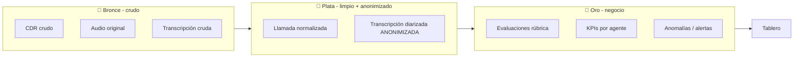
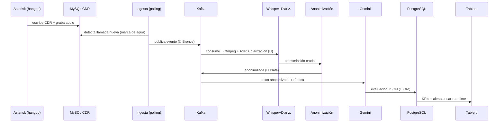

# Pipeline de datos — Batch y Streaming con arquitectura Medallion

> Explica **paso a paso** cómo fluye el dato en los dos caminos de la arquitectura
> híbrida (Lambda/Kappa): el **streaming** (llamada nueva, *near-real-time*) y el
> **batch** (reproceso del histórico por rango de fechas). Ambos escriben en las
> mismas **zonas Medallion** (Bronce → Plata → Oro).
> Complementa [tecnologias.md](tecnologias.md), [fases.md](fases.md) e
> [infraestructura.md](infraestructura.md).

---

## 0. Arquitectura Medallion (Bronce / Plata / Oro)

Medallion es un patrón para organizar el *data lake* en **tres zonas de calidad
creciente**. Cada zona es una carpeta/prefijo (Parquet en disco / **MinIO** on-prem
o **S3** en AWS) y/o tablas.

| Zona | Qué contiene | Estado del dato | Ejemplo en este proyecto |
|---|---|---|---|
| 🥉 **Bronce** | Datos **crudos**, tal cual llegan, inmutables | Sin limpiar, con PII, "fuente de verdad" reproducible | CDR crudo (JSON), audio original, transcripción cruda |
| 🥈 **Plata** | Datos **limpios, validados, anonimizados y conformados** | 1 fila = 1 llamada; sin PII; cruce CDR↔grabación↔transcripción | Llamada normalizada + transcripción diarizada **anonimizada** |
| 🥇 **Oro** | Datos **curados de negocio** listos para consumo | Agregados, KPIs, evaluaciones, alertas | `evaluaciones` (rúbrica), `kpis_agente`, `anomalias` |

**Reglas de oro:**
- Bronce **nunca se modifica** (permite reprocesar si cambia la lógica o la rúbrica).
- La **anonimización ocurre al pasar de Bronce a Plata**: **solo Plata/Oro pueden salir** hacia Gemini/Bedrock.
- **Batch y streaming escriben las mismas zonas** → el tablero ve métricas consistentes venga el dato de donde venga (capa servida única, estilo Lambda).

---

## 1. Pipeline STREAMING (near-real-time)

**Objetivo:** desde que el asesor **cuelga** hasta que la llamada aparece **analizada
en el tablero**, sin intervención manual. Cada paso indica la **tecnología** y la
**zona Medallion**.

### Paso 0 — El asesor cuelga (Asterisk)
- Asterisk detecta el `hangup`, **escribe la fila en `cdr` (MySQL)** y guarda la
  **grabación** (`.wav`, luego `.mp3`).
- *Tecnología:* **Asterisk + MySQL** (producción, ya existe). Nosotros **solo leemos**.

### Paso 1 — Detección e ingesta del evento
- Un **servicio de ingesta** (Python, siempre encendido) hace **polling incremental**
  del CDR: `SELECT ... WHERE calldate > :ultima_marca ORDER BY calldate`.
  Guarda una **marca de agua** (`uniqueid`/`calldate`) para no repetir.
- Por cada llamada nueva construye un **evento** con `call_id`, `src` (agente),
  `dst`, `duration`, `billsec`, `disposition` y **resuelve la ruta de la grabación**
  (usa `urlrecord` si existe; si no, reconstruye por `calldate`+`src` contra el
  índice de archivos — ver [fases.md](fases.md), Fase 1).
- **Publica el evento** en el *topic* **Kafka** `llamadas.finalizadas`.
  *(En AWS este evento va a **Amazon SQS**.)*
- *Tecnología:* **Python + conector MySQL + Apache Kafka** (o SQS).
- 🥉 **Bronce:** se deposita el **CDR crudo** (JSON) y se registra el **audio original**.

> **¿Y si el servidor de procesamiento está apagado (horario)?** El evento **queda en
> la cola** (Kafka/SQS) o simplemente en MySQL con la marca de agua. Al reencender, se
> procesa el backlog. Fuera de horario las llamadas son nulas/mínimas.

### Paso 2 — Normalización del audio
- El **consumidor ASR** lee el evento, localiza el `.mp3`/`.wav` y lo **convierte a
  formato estándar** para reconocimiento: **mono, 16 kHz, PCM**.
- *Tecnología:* **ffmpeg**.
- 🥉 **Bronce:** el audio normalizado se conserva junto al original.

### Paso 3 — Transcripción + diarización (ASR)
- Se ejecuta **faster-whisper** (`language="es"`) → texto con marcas de tiempo.
- **Diarización** (quién habla: **asesor** vs **cliente**, mismo canal) con
  **WhisperX/pyannote** → turnos etiquetados.
- **Verificación anti-alucinación:** se descartan/marcan segmentos de baja
  probabilidad, silencios largos o repeticiones sospechosas [ref. Careless Whisper].
- Publica en *topic* `transcripciones`.
- *Tecnología:* **faster-whisper + WhisperX/pyannote**.
- 🥉 **Bronce:** transcripción **cruda** (aún contiene PII).

### Paso 4 — Limpieza y ANONIMIZACIÓN  *(frontera de privacidad)*
- El **consumidor de anonimización** aplica:
  - **Regex** para cédula ecuatoriana, tarjetas, teléfonos, montos, correos.
  - **NER** con **spaCy español** (nombres, personas) vía **Microsoft Presidio**.
  - Limpieza/normalización del texto (muletillas, formato de turnos).
- Salida: **transcripción diarizada anonimizada** (`<CEDULA>`, `<TARJETA>`, `<NOMBRE>`…).
- Publica en *topic* `anonimizadas`.
- *Tecnología:* **Presidio + spaCy ES + regex**.
- 🥈 **Plata:** transcripción **limpia y anonimizada** + llamada normalizada
  (CDR↔grabación↔transcripción unificados, 1 fila por llamada).
- ✅ **A partir de aquí el texto puede salir a la nube** (ya no hay PII).

### Paso 5 — Análisis semántico (rúbrica + sentimiento)
- El **consumidor de análisis** envía el **texto anonimizado + la rúbrica**
  (`rubrica_v1`) a **Gemini** (o **Bedrock**) y pide **JSON estructurado**:
  criterios A/B/C, `calidad_score`, `venta_valida` (regla dura), `riesgo_reclamo`,
  `sentimiento_asesor`, `sentimiento_cliente_trayectoria`.
- Los **descargos legales exactos** (A07/C05) se verifican además con **fuzzy-match**
  local (no dependen solo del LLM).
- Validación del JSON con **pydantic**.
- Publica en *topic* `analisis.calidad`.
- *Tecnología:* **Gemini/Bedrock API + pydantic + rapidfuzz**.
- 🥇 **Oro:** registro de **evaluación** por llamada.

### Paso 6 — Persistencia en la capa servida
- La evaluación + métricas del CDR se **escriben en PostgreSQL** (tablas Oro:
  `llamadas`, `evaluaciones`).
- Se actualizan agregados (KPIs) por agente/periodo.
- *Tecnología:* **PostgreSQL** (o RDS en AWS).
- 🥇 **Oro**.

### Paso 7 — Visualización y alertas
- El **tablero** lee Oro y muestra la llamada casi en tiempo real. Si
  `infraccion_critica = true`, dispara **alerta** para auditoría.
- *Tecnología:* **Streamlit** (o QuickSight en AWS).

### Garantías del camino streaming
- **Idempotencia:** `call_id` como clave → no se reprocesa dos veces.
- **Tolerancia a fallos:** si un consumidor cae, retoma desde su *offset* (Kafka) sin
  perder eventos.
- **Latencia extremo-a-extremo:** se mide por llamada (métrica operativa de la tesis).

---

## 2. Pipeline BATCH (reproceso del histórico por fechas)

**Objetivo:** reprocesar el histórico (2017→hoy) por **rango de fechas** con la
**misma lógica** que el streaming, para métricas comparables y para el *backfill*
inicial.

### Paso 1 — Disparo parametrizado
- Se lanza un **job Spark** con parámetros `--desde 2026-03-01 --hasta 2026-03-31`.
- *Tecnología:* **Apache Spark / PySpark** (manual, `cron`, o **Prefect**).

### Paso 2 — Lectura masiva (CDR + índice de audio)
- Spark lee el **CDR por rango** vía **JDBC** y el **índice del filesystem** de
  grabaciones (walk recursivo de `.mp3`/`.wav`, incluyendo archivos "regados").
- *Tecnología:* **PySpark + JDBC MySQL**.
- 🥉 **Bronce:** CDR crudo + inventario de audio, **particionado por fecha** (Parquet).

### Paso 3 — Limpieza, cruce y filtrado (en paralelo)
- Normalización de tipos/teléfonos, **deduplicado**, `disposition` canónica.
- **Cruce CDR↔grabación** a escala (mismo resolvedor de la Fase 1).
- **Filtro por duración** (descarta fallidas/sin contacto/anómalas).
- **Normalización de audio** con **ffmpeg** en paralelo (incluye los `.wav` sin convertir).
- *Tecnología:* **PySpark + ffmpeg**.
- 🥈 **Plata** (parcial): llamadas normalizadas y cruzadas.

### Paso 4 — ASR + anonimización (en paralelo por particiones)
- Sobre la **muestra** seleccionada, cada *worker* de Spark ejecuta
  **faster-whisper + diarización** y luego **Presidio/spaCy** para anonimizar.
- *(Para la tesis se procesa una **muestra representativa**, no los 100 GB completos
  en CPU; el histórico total se puede hacer como **burst en AWS GPU** — ver
  [infraestructura.md](infraestructura.md).)*
- 🥈 **Plata:** transcripciones diarizadas **anonimizadas**, particionadas por fecha.

### Paso 5 — Análisis y agregación
- Se aplica la **rúbrica con Gemini** sobre el texto anonimizado (en lotes,
  respetando límites de la API) → **evaluaciones**.
- Se calculan **KPIs por agente y periodo** (contactabilidad, conversión, calidad,
  duración) y se corre la **detección de anomalías** (IsolationForest).
- *Tecnología:* **Gemini + pandas/PySpark + scikit-learn**.
- 🥇 **Oro:** evaluaciones + KPIs + anomalías.

### Paso 6 — Carga en la capa servida
- El **Oro** se carga en **PostgreSQL** con el **mismo esquema** que el streaming.
- Se mide el **speedup** (tiempo vs. núcleos/particiones) como evidencia de
  escalabilidad para el tribunal.
- 🥇 **Oro** → tablero.

```mermaid
flowchart LR
    P0[Parámetro rango fechas] --> SP[Spark: lee CDR JDBC + índice audio]
    SP --> BR[🥉 Bronce Parquet por fecha]
    BR --> CL[Limpieza + cruce + filtro + ffmpeg]
    CL --> ASR[ASR + diarización + anonimización]
    ASR --> SI[🥈 Plata por fecha]
    SI --> AN[Gemini rúbrica + KPIs + anomalías]
    AN --> GO[🥇 Oro]
    GO --> PG[(PostgreSQL)]
    PG --> T[Tablero]
```

---

## 3. Por qué ambos caminos y cómo conviven

| | **Streaming** | **Batch** |
|---|---|---|
| Motor | Kafka + consumidores | Spark / PySpark |
| Dispara | Llamada nueva (evento) | Rango de fechas (manual/programado) |
| Latencia | Segundos–minutos | Minutos–horas (según volumen) |
| Uso | Operación diaria near-real-time | *Backfill* histórico + métricas comparativas |
| Escribe en | 🥉🥈🥇 (mismas zonas) | 🥉🥈🥇 (mismas zonas) |

Ambos comparten **el mismo código de limpieza/rúbrica** y **la misma capa servida**,
que es justo lo que exige una arquitectura **Lambda/Kappa**: consistencia entre lo que
llega nuevo y lo que se reprocesa del pasado.

---

## 4. On-premise vs. AWS: el pipeline es el mismo

El **flujo lógico no cambia**; solo cambian las **piezas de infraestructura**:

| Paso del pipeline | On-Premise | AWS |
|---|---|---|
| Cola de eventos | Apache Kafka | Amazon SQS / MSK / Kinesis |
| Data lake Medallion | MinIO / disco (Parquet) | Amazon S3 (`bronze/silver/gold`) |
| Batch | Spark en contenedor | EMR / Glue / Spark en EC2 |
| ASR | faster-whisper (CPU) | Whisper en EC2 (GPU) / Transcribe |
| Anonimización | Presidio + spaCy | igual (o Amazon Comprehend) |
| LLM | Gemini API | Bedrock / Gemini API |
| Capa servida | PostgreSQL | RDS PostgreSQL |
| Tablero | Streamlit | QuickSight / Streamlit en EC2 |

Como todo va **contenedorizado**, migrar de uno a otro es cambiar la capa de
despliegue, no la lógica.
