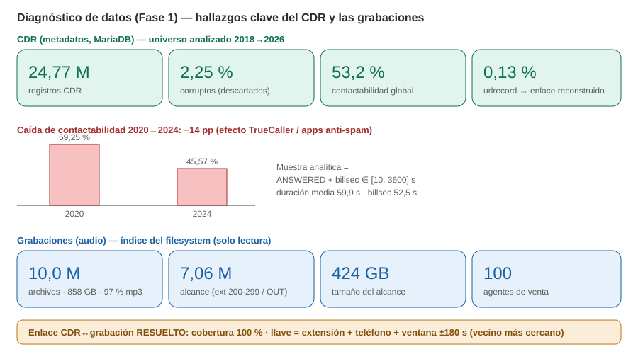
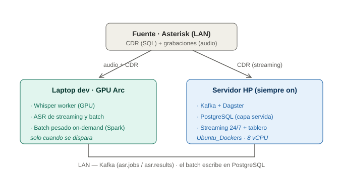
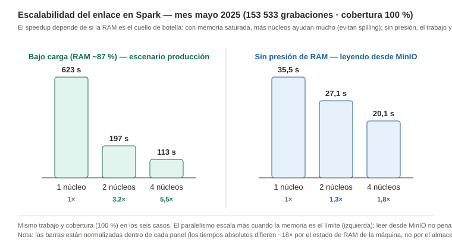
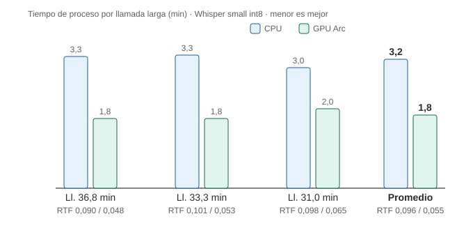
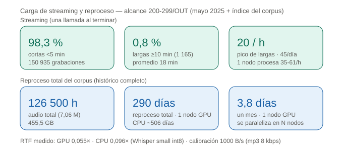
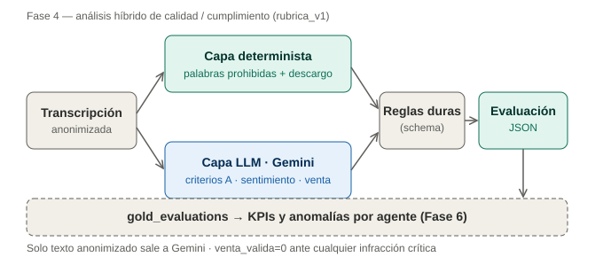

# Avance de implementación — Presentación 1

**Proyecto:** Solución Big Data para análisis de calidad y cumplimiento de llamadas del call
center de ventas (Corporación Marketing Vip S.A., aliada de Diners Club).
**Estado:** he implementado y validado el flujo de **procesamiento e inteligencia completo en
batch sobre datos reales de producción** (Fases 1, 0, 2, 3 y 4). Me quedan pendientes el
disparador de *streaming* (Fase 5) y el tablero (Fase 7).

---

## 1. Cómo procedí (metodología y ruta)

Trabajé con la metodología **DSR + CRISP-DM**, una arquitectura **Medallion** (Bronce→Plata→Oro)
e híbrida **Kafka (streaming) + Spark (batch)** orquestada por **Dagster**. Avancé de forma
incremental, validando y corrigiendo en cada fase:

| Fase | Qué hice | Resultado clave |
|---|---|---|
| **1 · Diagnóstico** | Perfilé el CDR, caractericé el audio y resolví el enlace | Enlace **100 %**; alcance definido (7,06 M grab. / 424 GB) |
| **0 · Infraestructura** | Levanté el stack dockerizado (Dagster + Kafka/KRaft + PostgreSQL + Streamlit) + worker | Un comando levanta todo; GPU Arc detectada |
| **2 · Batch (Spark)** | Implementé el cruce CDR↔grabación a escala + zonas Bronce/Plata | Cobertura 100 %, **speedup 6,9×** |
| **3 · ASR + privacidad** | Construí transcripción (GPU) + diarización + anonimización | **0 fugas de PII**; RTF 0,05× |
| **4 · Análisis (Gemini)** | Desarrollé la rúbrica híbrida (reglas + IA) sobre texto anonimizado | Detecta **"GARANTIZO"**; evaluación estructurada |

> **El hallazgo que me destrabó todo (enlace CDR↔grabación):** mi primer intento (por `uniqueid`)
> solo cruzaba **8,5 %**. Al diagnosticar en detalle descubrí que el nombre real de la grabación
> es `{fecha}-{extensión}-{teléfono}` y que la extensión del agente vive en `channel`/`dstchannel`
> (no en `src`, que es el troncal). Con la llave **extensión + teléfono + ventana ±180 s** logré
> subir la cobertura a **100 %**. Sin este hallazgo no habría trazabilidad audio↔CDR.

---

## 2. Análisis de datos (Fase 1 — diagnóstico)

Lo ejecuté en vivo contra la fuente real (**solo lectura**). Estos son los hallazgos que me
sirvieron para definir el alcance y la estrategia:



- **CDR:** encontré 24,77 M registros; 2,25 % corruptos (los descarto en Bronce);
  **contactabilidad 53 %** con una caída de **−14 pp (2020→2024)** por apps anti-spam
  (TrueCaller). El `urlrecord` está casi vacío (0,13 %) → confirmé que el enlace **no** puede ser
  por ruta directa, sino por reconstrucción.
- **Audio:** medí 10 M archivos / 858 GB. Acoté el proyecto al **call center de ventas**
  (extensiones 200-299, subcarpeta OUT) = **7,06 M grabaciones / 424 GB / 100 agentes**.
- **Enlace resuelto y validado al 100 %** (base del OE2): puedo unir cada grabación con su CDR.

| Mi decisión de diseño | Motivo (dato) |
|---|---|
| Descartar CDR corruptos | 2,25 % con `calldate = 0000-00-00` |
| Muestra = ANSWERED + billsec ∈ [10, 3600] s | duración media 59,9 s; outliers hasta ~86 días |
| Enlace por `ext + teléfono + ventana` | `urlrecord` poblado solo 0,13 %; `uniqueid` no aplica a ventas |
| Alcance solo 200-299 / OUT | separar ventas de administrativos/otras campañas |

---

## 3. Infraestructura y propuesta de equipo

### 3.1 Inventario de máquinas (verificado)

| Máquina | CPU | RAM | GPU | Rol | Limitación |
|---|---|---|---|---|---|
| **Laptop de desarrollo** | Core Ultra 9 288V | 32 GB | **Arc 140V (16 GB)** | Dev + batch + ASR (GPU) | No es servidor 24/7 (personal) |
| **Equipo oficina (opción 1)** | Core i5-1334U | 16 GB | Intel UHD (integrada) | — | **Sin GPU útil**; RAM justa |
| **Servidor HP DL160 Gen9** | 16 × Xeon E5-2609 v4 @ 1,7 GHz | 31,75 GB (88 % usada) | **Ninguna** | Streaming ligero | ESXi 6.0 EOL; sin GPU; lento |



### 3.2 Mejor opción y mi propuesta

Verifiqué que **ninguna** máquina actual sostiene el proyecto completo (Docker 24/7 **+ GPU para
ASR/diarización + Spark**). La laptop me sirve para desarrollo, pero no como servidor; el i5 no
tiene GPU; el HP no tiene GPU y está EOL. Por eso **propongo comprar un equipo dedicado con GPU
NVIDIA** para la oficina (en la LAN, 24/7). Una GPU NVIDIA acelera Whisper (CUDA) **y** la
diarización (torch-CUDA), eliminando el cuello que hoy tengo (diarización en CPU).

| Componente | Mínimo (cubre el proyecto) | Deseable (holgura + histórico) |
|---|---|---|
| **CPU** | 8 núcleos / 16 hilos (i7-14700 / Ryzen 7 7700X) | 12–16 núcleos (i9 / Ryzen 9 / Xeon) |
| **GPU** | **NVIDIA RTX 4060 Ti 16 GB** | RTX 4080/4090 o A4000/A5000, o RTX 3090 24 GB |
| **RAM** | 32 GB DDR5 | 64–128 GB DDR5 |
| **Almacenamiento** | 1 TB NVMe SSD | 2 TB NVMe + 4 TB HDD/SSD (histórico) |
| **SO / Red** | Ubuntu Server LTS · Gigabit | + UPS de respaldo |

**En producción** propongo correr todo el stack + worker GPU en el equipo nuevo (LAN →
privacidad). Dejaría el HP como complemento/streaming y el i5 como terminal de consulta.

---

## 4. Arquitectura y orquestación

Resumo todo el sistema en una sola imagen — fuente, zonas Medallion, bus Kafka, worker GPU,
frontera de privacidad, Gemini y capa servida:


| Tecnología | Rol | Por qué la elegí |
|---|---|---|
| **Dagster** | Orquestador (assets = zonas Medallion) | Linaje, particiones/backfill (batch) y sensores (streaming) |
| **Kafka (KRaft)** | Bus que **desacopla** el ASR | Sin Zookeeper; el worker GPU escucha una cola |
| **Spark** | Preparación batch a escala | Speedup 6,9× demostrado |
| **Whisper worker (OpenVINO)** | Transcripción en **GPU** | El audio no sale de la LAN |
| **pyannote** | Diarización agente/cliente | Separa hablantes en audio mono |
| **Presidio + spaCy** | **Anonimización** (frontera PII) | Solo texto anonimizado va a la nube |
| **Gemini** | Análisis de calidad/cumplimiento | Juicio contextual sobre la rúbrica |
| **PostgreSQL** | Capa servida | Alimenta tablero y métricas |

**Diseñé batch y streaming como el mismo flujo, con distinto disparo.** Comparten el 100 % de los
módulos y el bus Kafka. El batch (ya implementado) se dispara por fechas; para el streaming
(Fase 5) solo me falta agregar un **sensor** que detecte la llamada nueva — el worker ya funciona
como consumidor de cola.

---

## 5. Resultados con datos reales

### 5.1 Fase 2 — Escalabilidad batch (Spark)

Validé el cruce CDR↔grabación con **100 % de cobertura** (mayo 2025: 153 533/153 533). Medí la
escalabilidad del mismo trabajo variando núcleos:



### 5.2 Fase 3 — Audio → texto seguro

Implementé la transcripción con Whisper en GPU (RTF 0,05×, 18× más rápido que tiempo real), la
diarización agente/cliente y la anonimización (cédula, tarjeta, teléfonos, nombres, números
dictados) → verifiqué **0 fugas de PII**.



### 5.3 Carga de negocio y escala del histórico



Encontré que el 98,3 % de las llamadas son cortas y solo el 0,8 % largas. Un solo nodo sostiene
el streaming; el reproceso total del histórico (~126 500 h de audio) son ~290 días-GPU, así que
proceso por muestra + streaming y paralelizo para el histórico completo.

### 5.4 Fase 4 — Análisis de cumplimiento (Gemini)



Desarrollé un análisis híbrido (reglas + IA) contra la rúbrica de la empresa. **Mi caso estrella:**
el sistema detectó automáticamente **"GARANTIZO"** (palabra prohibida CRÍTICA → riesgo de multa de
la Superintendencia) en una llamada real — algo que la auditoría manual no alcanza a revisar.

### 5.5 Ejemplos reales que procesé (3 llamadas, con tiempos y diarización)

Procesé 3 llamadas largas de venta de extremo a extremo (transcripción → diarización →
anonimización → evaluación):

| Llamada | Duración | ASR (GPU) | Diarización (CPU) | Turnos / hablantes | Palabras prohibidas | Riesgo | Sentimiento cliente |
|---|---|---|---|---|---|---|---|
| ag. 203 | 36 min | 106 s (RTF 0,05×) | 1 841 s (~31 min) | 132 / 2 | B13, B16 | medio | confundido → interesado → desconfiado |
| **ag. 204** | 33 min | 105 s | 1 711 s (~28 min) | 83 / 2 | **B01 GARANTIZO**, B08, B13, B16 | **alto** | neutral → escéptico → negativo |
| ag. 217 | 30 min | 120 s | — | — | B06, B12, B13, B16 | alto | neutral → dudoso → neutral |

> **Nota de rendimiento:** la diarización en CPU me tarda ~30 min por llamada larga (~15× el ASR
> en GPU). Es mi argumento cuantitativo directo para la GPU NVIDIA que propongo (§3.2).

**Salida real (diarizada + anonimizada), extracto del ejemplo 1:**

```
ASESOR:  Si logro escucharme buenos días.
CLIENTE: Si buenos días, tranqui.
ASESOR:  Es un gusto saludar al señor <NOMBRE>. Mi nombre es <NOMBRE>, me comunico
         desde Quito para la entrega de documentos de respaldo legal para el trámite
         de una visa norteamericana...
CLIENTE: Perdón, no lo entendí.
ASESOR:  No se preocupe, <NOMBRE>. Le mencionaba que...
```

*(La versión "cruda" conserva los nombres reales; la anonimizada — la única que envío a Gemini —
los reemplaza por `<NOMBRE>`, `<TELEFONO>`, `<CEDULA>`, `<TARJETA>`, `<DATO_NUMERICO>`.)*

---

## 6. Lo que sigue y pendientes por pulir

**Me falta implementar (cierre del flujo):**
1. **Fase 5 — Streaming:** sensor de Dagster + encadenado en vivo (reusa todo lo anterior).
2. **Fase 7 — Tablero:** KPIs, riesgo y palabras prohibidas por agente (Streamlit).
3. **Fase 6 — Anomalías:** detección no supervisada de rendimiento por agente/periodo.

**Tengo por pulir (calidad, lo dejé para después de la validación del tutor):**
4. **Modelo ASR superior** (`medium`/`large-v3`): el `small` que uso hoy tiene errores
   ("Marketing BIP" ≈ VIP, "Banco Pincel" ≈ Pichincha) → haré un benchmark de tiempo vs exactitud.
5. **Afinar la sobre-redacción:** hoy es agresiva del lado seguro (marca "Claro", "Pichincha"
   como nombre) → agregaré una lista blanca de marcas/lugares.
6. **Diarización:** algún turno corto queda sin rol (`?`); mejora con GPU y ajuste de umbrales.
7. **Gold set (weak supervision):** revisaré con un auditor una muestra estratificada → métricas
   **Accuracy / Precision / Recall / F1** contra línea base; calibraré los pesos de `calidad_score`.
8. **Regla `es_venta`:** el descargo legal (A07/C05) solo lo exijo a llamadas que cerraron venta.

**Inversión:** el equipo nuevo con GPU (§3.2) para llevar todo a producción en la oficina.

---

*Detalle técnico completo y reproducible en `docs/bitacora_tecnica.md` (Partes A–G). Figuras en
`docs/figuras/`.*
